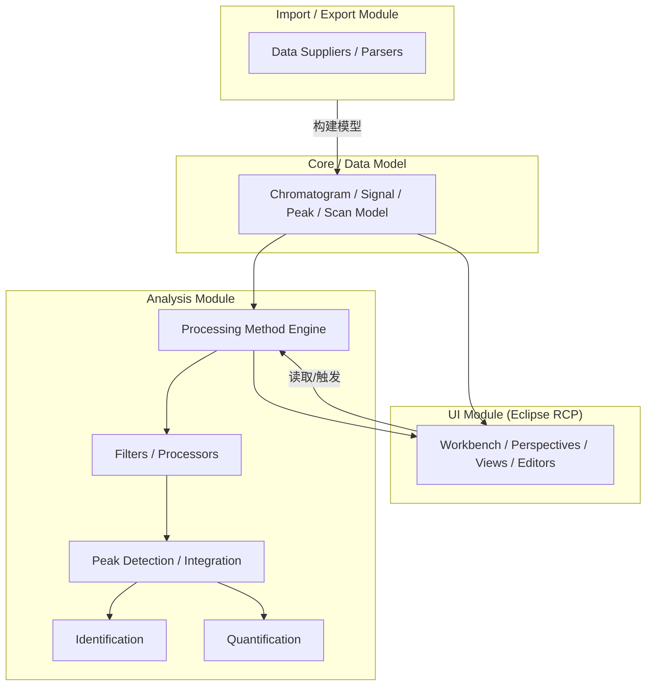

# 00 — OpenChrom Repository Map（仓库地图）

> **⚠️ 必读入口**：任何 AI 执行任务前，先完整读取 [README.md（主控文档）](README.md)。
> 本文件是 00–10 各文档共享的分析规范与总纲；主控文档负责流程编排与状态跟踪。

> **当前状态：🔶 框架版（源码未就位）**
> 本文档是逆向工程的总纲 + 分析规范 + 仓库结构假设。源码克隆后就地回填并逐条升级为「✅ 源码确认」。
>
> 维护规则：**任何新结论必须能追溯到具体源码文件、类、方法**，否则标「⚠️ 背景假设（待验证）」。

---

## 1. 分析规范（所有 00–10 文档通用）

### 1.1 结论分级（每条结论必须有且仅有一种状态）

| 标记 | 含义 | 何时使用 |
|---|---|---|
| ✅ 源码确认 | 已在本仓库源码中读到该类/方法/调用 | 分析阶段填写 |
| ⚠️ 背景假设（待验证） | 基于 Eclipse RCP 通用框架 / 项目历史背景的经验，**未在本次源码中确认** | 框架阶段使用 |
| 🔲 待填充 | 结构已预留，待源码分析时填写 | 框架阶段使用 |
| ❓ 未确认问题 | 无法从现有材料确认，需进一步调查 | 随时记录 |

### 1.2 证据格式（每条重要结论必须附 Source）

```text
Source:
- 文件: <相对路径>
- 类: <ClassName>
- 方法: <methodName()>
- 证据说明: <这句代码为什么支撑该结论（引用关键行）>
```

### 1.3 溯源红线（来自任务书，逐条遵守）

- ❌ 不修改业务代码、不重构、不新增功能、不为方便理解改源码
- ❌ 不凭文件名猜测功能（`XxxProcessor` 不代表它就是处理器，必须读实现）
- ❌ 不把 README / 官方文档当源码事实（只作为**线索**，再进源码验证）
- ❌ 不允许编造调用关系（画调用图之前必须逐个确认边）
- 无法确认的内容一律标「待验证」

### 1.4 完成度追踪

每份文档顶部带一个「状态」徽章。全仓库分析结束后，目标是把所有 ⚠️ 逐条升级为 ✅ 或删除。

---

## 2. 分析阶段总览（对齐任务书 10 个 Phase）

| Phase | 文档 | 状态 |
|---|---|---|
| 1 | 00_repository_map.md（本文件） | 🔶 框架版 |
| 2 | 01_startup_and_runtime.md | 🔶 框架版 |
| 3 | 02_data_flow.md | 🔶 框架版 |
| 4 | 03_data_model.md | 🔶 框架版 |
| 5 | 04_signal_processing_inventory.md | 🔶 框架版 |
| 6 | 05_peak_engine.md | 🔶 框架版 |
| 7 | 06_quantification.md | 🔶 框架版 |
| 8 | 07_ui_architecture.md | 🔶 框架版 |
| 9 | 08_plugin_architecture.md | 🔶 框架版 |
| 10 | 09_testing_and_validation.md | 🔶 框架版 |
| 汇总 | 10_openchrom_reverse_engineering_summary.md | 🔶 框架版 |

---

## 3. 仓库顶层结构

### 3.1 预期顶层布局（⚠️ 背景假设，待源码核对）

基于 OpenChrom 长期采用的 Eclipse Tycho / OSGi 工程布局，仓库根目录预计包含：

| 项 | 预期 | 依据 |
|---|---|---|
| 构建 | 根 `pom.xml`、`.mvn/`（含 Maven toolchains / extensions）、可能有 `build.properties` 或 `*.target`（target platform 定义） | Tycho 工程惯例 ⚠️ |
| 工程组织 | 大量 OSGi bundle（eclipse 插件），每个插件一个目录 + `META-INF/MANIFEST.MF` | OSGi bundle 惯例 ⚠️ |
| 产品/特性 | `net.openchrom.product.*`、`net.openchrom.feature.*` 目录，定义可发布产品 | Eclipse RCP 惯例 ⚠️ |
| 文档 | `README*`、`CONTRIBUTING*`、licenses、可能是 `.md`/`.txt` | — ⚠️ |

> **待验证问题 Q0.x**
> - Q0.1 根目录实际有哪些条目（用 `ls` 核对）？
> - Q0.2 构建是纯 Tycho 还是混合（gradle / bnd / ant）？
> - Q0.3 target platform 定义在哪里？基于哪个 Eclipse release？

### 3.2 二级目录 / 模块清单（🔲 待填充）

> 以下按「任务书要求的分类」建立空表，源码到位后逐一回填实际 bundle 名与职责。

| 分类 | 实际 bundle / 目录 | 职责 | 证据 | 状态 |
|---|---|---|---|---|
| core/data module | | | | 🔲 |
| analysis module | | | | 🔲 |
| import/export module | | | | 🔲 |
| UI module | | | | 🔲 |
| plugin framework | | | | 🔲 |
| test module | | | | 🔲 |
| build | | | | 🔲 |

> 命名约定待确认：`net.openchrom.*` 包前缀在 1.x 与 2.x 是否有变化？旧 `openchrom.*`（无 net）是否仍存在？⚠️

---

## 4. 构建系统（⚠️ 背景假设 + 🔲 待填充）

### 4.1 预期（⚠️ 背景假设）

- Eclipse Tycho（Maven）驱动：`mvn clean verify` 或 `mvn -f <product>/pom.xml tycho-p2-director:director`
- 每个插件目录带 `META-INF/MANIFEST.MF` + `build.properties`（source 目录声明）
- target platform 决定 Eclipse SDK / JFace / SWT / Equinox 版本
- 产品入口由 `*.product` 文件描述（含 `application` 属性，指向 Application 类）

### 4.2 待确认清单（🔲 待填充）

| # | 待确认项 | 证据位置 | 状态 |
|---|---|---|---|
| B1 | 根 pom 的 parent / module 列表 | | 🔲 |
| B2 | target platform 文件与 Eclipse 版本 | | 🔲 |
| B3 | `.product` 文件路径与其 application 属性 | | 🔲 |
| B4 | 每个 bundle 的 build.properties 是否声明 test source | | 🔲 |
| B5 | 是否使用 Eclipse Orbit 第三方库 | | 🔲 |

---

## 5. 插件系统概述（详见 08）

- 预期：OSGi bundle + Eclipse ExtensionRegistry（`plugin.xml` 里的 extension / extension-point）
- 关键扩展点候选（⚠️ 背景假设，具体名称待确认）：数据导入器、处理器（processor）、滤波器（filter）、标识器（identifier）、峰检测器、积分器、定量器
- 详见 `08_plugin_architecture.md`

---

## 6. 模块依赖关系图（🔲 待填充）

> 此图目前是**占位假设**，每个边都要在 02/08 中逐个验证后才可升级。



> 标注：以上边的真实存在性均为 🔲，需在 02_data_flow.md 中用真实调用链替换。

---

## 7. 数据规模与边界（后续分析时记录）

| 项 | 记录 | 状态 |
|---|---|---|
| bundle 总数 | | 🔲 |
| Java 源码文件数 | | 🔲 |
| 总代码行数（约） | | 🔲 |
| 测试文件数 / 覆盖率线索 | | 🔲 |

---

## 8. 证据登记表（全仓库汇总，🔲 待填充）

| # | 结论 | Source(文件/类/方法) | 状态 |
|---|---|---|---|
| R1 | | | 🔲 |
| R2 | | | 🔲 |

---

## 9. 未确认问题清单（❓ 待验证）

| # | 问题 | 关联 Phase |
|---|---|---|
| Q0.1 | 仓库根目录实际条目？ | 1 |
| Q0.2 | 构建方式（纯 Tycho？混合？）？ | 1 |
| Q0.3 | target platform 基于哪个 Eclipse 版本？ | 1 |
| Q0.4 | `net.openchrom.*` 包前缀是否全仓库统一？ | 1 |
| Q0.5 | 数据模型是自研模型还是 EMF 模型？ | 4 |

---

*下次工作起点：将 OpenChrom 源码放入仓库根目录 → 执行 Phase 1（核对本文件第 3/4/5 节）→ 按 01–10 顺序回填。*
