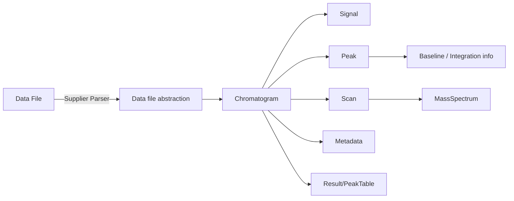

# 03 — Core Data Model（核心数据模型）

> **当前状态：🔶 框架版（源码未就位）**
> 目标：逆向 `Chromatogram / Signal / Peak / Scan / Spectrum / Data file abstraction / Metadata / Result`。
> 每个核心对象必须说明：类名、文件位置、核心成员、生命周期、谁创建、谁修改、谁读取、与其他对象关系，并给出 UML/Mermaid 图。

---

## 1. 核心对象清单（本 Phase 必查对象）

| # | 对象 | 预期含义（待源码确认） |
|---|---|---|
| M1 | Chromatogram | 色谱图（总离子流 / 特定 m/z 提取流等） |
| M2 | Signal | 离散信号/数据点（x: 时间或扫描号, y: 强度） |
| M3 | Peak | 色谱峰（起止/顶点/基线/积分结果） |
| M4 | Scan | 单个质谱扫描 |
| M5 | Spectrum / MassSpectrum | 质谱（m/z - 强度对列表） |
| M6 | Data file abstraction | 数据文件抽象（供应商无关的访问接口） |
| M7 | Metadata | 元数据（样品信息、采集参数、方法、注释） |
| M8 | Result | 分析结果（峰表、鉴定、定量结果） |

---

## 2. 背景假设（⚠️ 待验证，仅作线索）

| # | 假设 | 说明 | 状态 |
|---|---|---|---|
| D1 | 模型按检测器类型分化（如 MSD/CSD/等），有基类接口 + 子接口 | 命名可能含 `IChromatogram*` 前缀 ⚠️ | ⚠️ |
| D2 | 接口与实现分离，模型常带 listener 通知机制 | 便于 UI 刷新 ⚠️ | ⚠️ |
| D3 | 对象间用「拥有(composition)」而非仅引用：Chromatogram 拥有 Signal 列表、Peak 列表等 | 需确认读写方法（add/get）⚠️ | ⚠️ |
| D4 | 峰对象内嵌基线/积分信息（面积、高度、起点终点、拖尾因子等） | 字段名待确认 ⚠️ | ⚠️ |
| D5 | 元数据与数据分离存储 | 待确认 ⚠️ | ⚠️ |
| D6 | 是否存在内存中的 `IModel` 顶层接口 / 抽象工厂 | 待确认 ⚠️ | ⚠️ |

---

## 3. 对象档案模板（每个对象一节，🔲 待填充）

### 3.1 模板示例（以 Chromatogram 为例，回填时逐条替换）

```text
### M1: Chromatogram
- 类名(接口): IChromatogram     实现: <XxxChromatogram>
- 文件位置: <路径>/<类>.java
- 核心成员: <字段列表，含类型>
- 生命周期: 由 <谁> 在 <时机> 创建；在 <时机> 销毁/释放
- 创建者: <类/方法>
- 修改者: <类/方法>（如 addSignal / set...）
- 读取者: <类/方法>（如 UI 视图 / 处理器）
- 与其它对象关系: Chromatogram ──拥有──> Signal[] ; Chromatogram ──拥有──> Peak[]
- 证据: Source(文件/类/方法) + 关键行
```

> 每个对象按同一模板各写一节。不能确认的字段写「❓ 待验证」。

---

## 4. 关系图（占位，回填后升级为 ✅）



> 图中每条边当前均为假设，需在 02/04/06 中交叉验证真实方法调用后升级。

---

## 5. 待确认问题清单（❓）

| # | 问题 |
|---|---|
| D1Q | 是否按检测器（MSD/CSD/其他）拆分子接口？命名与层级？ |
| D2Q | 模型是否实现 listener / observable？事件粒度？ |
| D3Q | 数据点存数组还是列表？可变还是只读视图？ |
| D4Q | Peak 上缓存的派生量（面积/高度/宽度）何时计算、何时失效？ |
| D5Q | Metadata 是独立类还是 map/属性集合？序列化方式？ |
| D6Q | 是否存在统一 `IModel`/工厂/服务定位，还是 `new` 直接构造？ |
| D7Q | 模型对象的跨线程约束？（SWT UI 线程 vs 后台处理线程） |

---

## 6. 输出要求（回填后必须给出）

1. 每个核心对象一份完整档案（按 §3.1 模板）。
2. 一张**已验证**的类关系图（UML/Mermaid），边注明方法。
3. 对象生命周期总览：创建/修改/读取/销毁的调用方矩阵。
4. 与 02（数据流）、04/05（处理）、07（UI 读取）的交叉引用清单。
