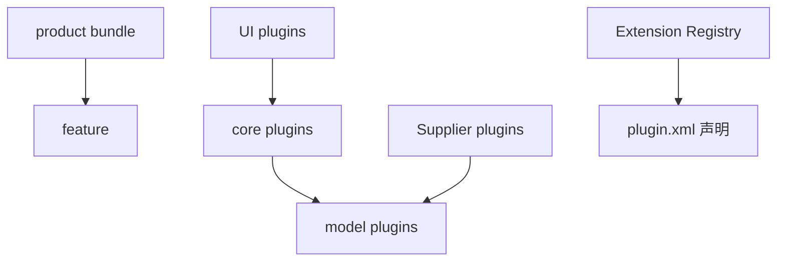

# 08 — Plugin Architecture（插件架构）

> **当前状态：🔶 框架版（源码未就位）**
> 目标：详细分析 plugin discovery / registration / extension point / service / dependency / lifecycle。
> 结论须追溯到 plugin.xml / MANIFEST.MF / Extension 实现代码；无法确认处标「待验证」。

---

## 1. 本 Phase 要逆向的主题清单

| # | 主题 | 必答问题 |
|---|---|---|
| PL1 | Plugin discovery | bundle 如何被发现/激活（OSGi 启动顺序） |
| PL2 | Registration | 插件如何把自己的实现注册到扩展点 |
| PL3 | Extension point | 有哪些自定义扩展点？各自的 schema（XML 结构） |
| PL4 | Service | 是否使用 OSGi Declarative Services(DS) 或服务注册？ |
| PL5 | Dependency | bundle 间依赖（Import-Package / Require-Bundle） |
| PL6 | Lifecycle | bundle Activator、启动/停止钩子 |

---

## 2. 背景假设（⚠️ 待验证，仅作线索）

| # | 假设 | 说明 | 状态 |
|---|---|---|---|
| E1 | 基于 Eclipse Equinox OSGi + ExtensionRegistry | RCP 惯例 ⚠️ | ⚠️ |
| E2 | 供应商（文件格式）是典型的「实现一个接口 + 在 plugin.xml 声明扩展」 | 待确认 ⚠️ | ⚠️ |
| E3 | 处理器/滤波器/标识器/定量器等均可能有扩展点 | 具体点 ID 待确认 ⚠️ | ⚠️ |
| E4 | 主代码通过 `IExtensionRegistry`/`IExtensionPoint` 枚举并实例化扩展 | RCP 惯例 ⚠️ | ⚠️ |
| E5 | 可能少量使用 Declarative Services | 待确认 ⚠️ | ⚠️ |

---

## 3. 扩展点登记表（🔲 待填充）

| 扩展点 ID（plugin.xml） | 所在 bundle | schema 要点 | 谁消费 | 谁提供 | 状态 |
|---|---|---|---|---|---|
| （数据导入/供应商） | | | | | 🔲 |
| （处理器/处理方法） | | | | | 🔲 |
| （滤波器） | | | | | 🔲 |
| （峰检测/积分） | | | | | 🔲 |
| （标识） | | | | | 🔲 |
| （定量） | | | | | 🔲 |
| （UI 相关） | | | | | 🔲 |

> 具体 ID 一律从 plugin.xml 实际读出后填写，❌ 不凭命名猜测。

---

## 4. bundle 依赖关系图（占位，回填后升级）

> 每条边当前均为假设，需从 MANIFEST.MF 的 Import-Package/Require-Bundle 与代码实际引用确认。

---

## 5. 待确认问题清单（❓）

| # | 问题 |
|---|---|
| E1Q | 是否真的存在 ExtensionRegistry 消费模式？（`IExtensionRegistry` 出现在哪些类） |
| E2Q | 供应商如何被 UI 枚举（打开文件时）？ |
| E3Q | 扩展点的 `schema`（`<extension-point>` 定义）在哪里？ |
| E4Q | 插件间用接口共享还是对象共享？接口在哪个 bundle 定义？ |
| E5Q | 是否使用 DS（component.xml / annotations）？ |
| E6Q | 第三方库如何管理（Orbit / 内嵌 jar / 系统库）？ |
| E7Q | 插件版本/升级机制（feature 依赖版本约束）？ |

---

## 6. 输出要求（回填后必须给出）

1. 扩展点完整清单（ID / schema / 提供方 / 消费方）。
2. bundle 依赖图（基于真实 MANIFEST 数据）。
3. 扩展实例化时序（谁、何时、如何 `new` 出实现对象）。
4. 供应商扩展的端到端示例（从 plugin.xml 声明到被调用）。
