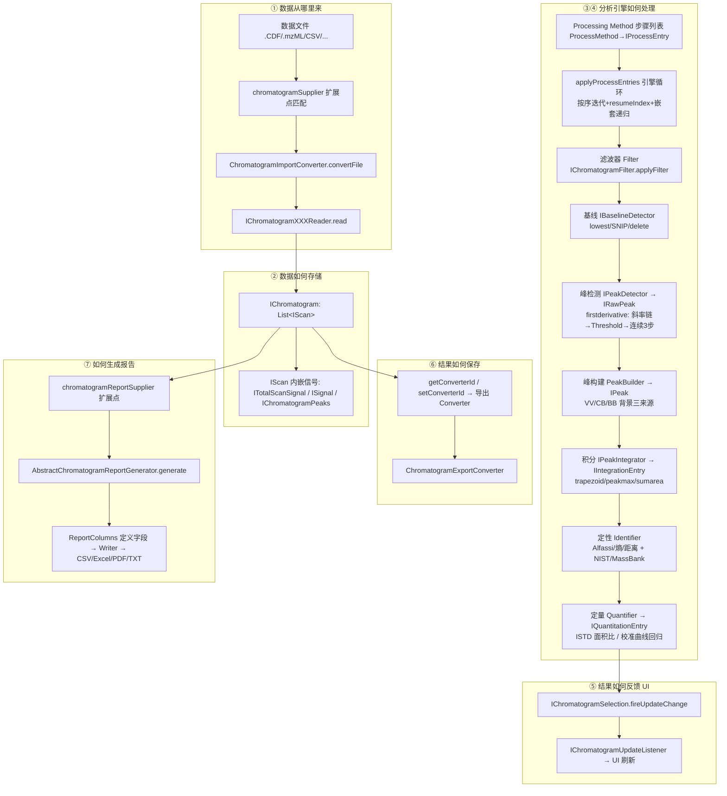

# MODULE_00 — 模块级逆向总图（Pipeline Map）

> **状态：🟢 已回填（全链路源码已确认，2026-08-17）**
> 本系列文档的目标读者：**后续用 Qt/C++ 自研 CDS 的开发 agent**。
> 逆向主轴：**数据模型 + 算法 + 工作流**，围绕 6 个「核心中间层」展开。
> 证据标记：✅ 源码确认 ｜ ⚠️ 背景假设（待验证）｜ ❓ 待验证

---

## 1. 本系列文档回答什么

按用户指定链路，逆向 OpenChrom 的**数据从哪里来到报告如何生成**，并把每一层拆成可被 Qt/C++ 复刻的规格：

```text
数据从哪里来        → MODULE_01 Raw Data（原始数据层）
数据如何存储        → MODULE_02 Chromatogram Model（色谱模型层）
数据如何进入分析引擎 → MODULE_03 Processing Pipeline（处理管线层）
分析引擎如何处理    → MODULE_03 + MODULE_04 Peak Model（峰模型层）
结果如何反馈 UI     → MODULE_03（事件/选择机制）+ MODULE_04
结果如何保存        → MODULE_01（ConverterId/导出）+ MODULE_02（模型状态）
最后如何生成报告    → MODULE_06 Report Model（报告模型层）
定量                → MODULE_05 Quantification Model（定量模型层）
```

## 2. 六个核心中间层与源码位置

| # | 中间层 | 核心源码在哪个仓库 | 文档 |
|---|---|---|---|
| 1 | Raw Data | 两仓库都有（converter supplier 插件） | MODULE_01 |
| 2 | Chromatogram Model | **ChemClipse 核心**（`org.eclipse.chemclipse.model` 等） | MODULE_02 |
| 3 | Processing Pipeline | **ChemClipse 核心**（`org.eclipse.chemclipse.processing`、`chromatogram.method.model`）+ OpenChrom 增量 | MODULE_03 |
| 4 | Peak Model | **ChemClipse 核心**（`org.eclipse.chemclipse.model.core.IPeak*`） | MODULE_04 |
| 5 | Quantification Model | **ChemClipse 核心**（`xxd.quantitation` + `supplier.chemclipse`） | MODULE_05 |
| 6 | Report Model | 两仓库都有（report supplier 插件） | MODULE_06 |

### 2.1 横切层（UI 与插件架构）

| # | 横切层 | 核心源码在哪个仓库 | 文档 |
|---|---|---|---|
| 7 | UI 架构 | ChemClipse（`org.eclipse.chemclipse.ux.*`，不在本机）+ 本仓库 UI 壳（*.ui 插件） | MODULE_07 |
| 8 | 插件/扩展点架构 | 扩展点**定义**在 ChemClipse，本仓库 68 插件**全为扩展点实现**（plugin.xml） | MODULE_08 |

## 3. 仓库源码边界（2026-08-17 更新：ChemClipse 核心已全量本地化）

- OpenChrom = ChemClipse 基础 + `net.openchrom.*` 社区增量（README.md 已写明：*"based on ChemClipse … does not contain vendor specific file format converters nor commercial extensions"*）✅
- 本仓库含 **68 个 `net.openchrom.*` 插件**：转换器、报告、处理器、标识器、AMDIS 桥接、xxd.base。✅
- **核心数据模型 / 处理引擎 / 基线 / 积分 / 定量 / 报告基类都在 ChemClipse**（`org.eclipse.chemclipse.*`）。**2026-08-17 已把 chemclipse 全量源码抓取到 `.fetch/chemclipse-src/plugins/`（228 插件）**，此前所有标 ❓ 的核心结论现均可本机取证。✅
- `.fetch/chemclipse_tree.json` 是 ChemClipse 仓库**完整目录树**，可继续用作「模块定位索引」；`.fetch/chemclipse-src/plugins/<插件名>/` 是实际源码。

### 3.1 本机源码资源（2026-08-17 更新）

| 资源 | 路径 | 内容 |
|---|---|---|
| 社区插件源码 | `openchrom/plugins/` | 68 个 `net.openchrom.*` 插件完整源码 |
| **ChemClipse 核心源码** | `.fetch/chemclipse-src/plugins/` | **228 个 `org.eclipse.chemclipse.*` 插件完整源码**（本轮深挖全部基于此） |
| ChemClipse 目录树索引 | `.fetch/chemclipse_tree.json` | 插件目录定位（模块 → 插件路径） |
| 早期核心接口样本 | `.fetch/sources/` | 15 个接口文件（已被 chemclipse-src 取代，可弃） |

## 4. 端到端数据流（✅ 有证据的部分 + ❓ 待验证部分）



> 标注说明（2026-08-17 更新）：**全链路已全部有源码证据**（F–M 的引擎循环/滤波器/基线/峰检测/建峰/积分/鉴定/定量，各见 MODULE_03/04/05/11/12 的 ✅ 结论）。

## 5. 模块 → 插件映射（以本仓库 68 插件 + ChemClipse 目录树为基础）

| 层 | 本仓库（net.openchrom.*） | ChemClipse（org.eclipse.chemclipse.*，路径见 tree JSON） |
|---|---|---|
| Raw Data | converter.supplier.{cdf,animl,gaml,rdx3,mz5,mzdb,mzmlb,mgf,btmsp,cms,microbems.*,arw,abif,axr} | converter 框架 + supplier.{mzml,jcampdx,cml,csv,ascii,ocx,amdis,excel,..} |
| Model | xxd.base（PeakRegionParameter） | model, msd.model, csd.model, wsd.model, vsd.model, fsd.model, tsd.model |
| Pipeline | processor.supplier.tracecompare, process.supplier.{templates,cms}, processor.supplier.massshiftdetector | processing, chromatogram.method.model, xxd.filter + 各 filter supplier, xxd.calculator.* |
| Peak | msd.peak.detector.supplier.amdis（外部程序桥） | model.core.IPeak*, peak.detector, xxd.baseline.detector, xxd.integrator + supplier.{trapezoid,peakmax,sumarea}, peak.detector.supplier.{first,third}derivative |
| Quant | — | xxd.quantitation, xxd.quantitation.supplier.chemclipse(.ui) |
| Report | xxd.report.supplier.{csv,excel.template,pdf.ui} | xxd.report, xxd.report.supplier.{pdf,txt,image.ui} |

## 6. Qt/C++ 复刻的总体结论（⚠️ 设计方向，随证据回填修正）

- **模型接口抽象值得照搬**：IChromatogram/IPeak/IPeakModel 的字段语义（RT 毫秒制、相对强度 0–100% 归一化、start/apex/stop 三要素）是色谱领域通用约定，可转成 Qt 原生结构。
- **事件机制必须替换**：Java 的 listener/update 广播 → Qt signals/slots；`IChromatogramSelection` + `fireUpdateChange` 的模式直接对应 Qt 的 `QModelIndex` + `dataChanged` 信号。
- **算法层可移植**：一阶导数峰检测、线性基线方程优化、S/N 阈值——都是纯数值算法，与语言无关（见 MODULE_04）。
- **插件机制不必照搬 OSGi**：`QPluginLoader` + JSON 清单即可表达「转换器/处理器/报告器」扩展点。

## 7. 各模块文档的状态（2026-08-17 更新）

| 文档 | 状态 | 已回填证据 |
|---|---|---|
| MODULE_01 raw_data | 🟢 | 导入链 + ocx 原生格式（R-A~R-AN）✅ |
| MODULE_02 chromatogram_model | 🟢 | IChromatogram + IScan/ISignal 接口定义（C-A~C-AG）✅ |
| MODULE_03 processing_pipeline | 🟢 | 引擎循环 + 设置序列化（P-A~P-AI）✅ |
| MODULE_04 peak_model | 🟢 | 峰检测基类 + 基线/SNIP/积分（PK-A~PK-BK）✅ |
| MODULE_05 quantification | 🟢 | ISTD + 校准曲线回归（Q-A~Q-Z）✅ |
| MODULE_06 report | 🟢 | 核心框架 + 字段模型 + UI 链（RP-A~RP-Y）✅ |
| MODULE_07 ui | 🟢 | 方法编辑器 + 事件链 + 工作台 ✅ |
| MODULE_08 plugin_extension | 🟢 | 37 扩展点注册表 ✅ |
| MODULE_09 peak_shape_model | 🟢 | 峰形数学 + PeakBuilder 三变体 ✅ |
| MODULE_10 signal_filters | 🟡 | 滤波器族 ✅（splitter 细节 ❓） |
| MODULE_11 identification | 🟢 | 相似度三公式 + NIST/MassBank ✅ |
| MODULE_12 classifier_calculator | 🟢 | 分类器 + 计算器族 ✅ |

## 8. Qt 工程模块映射（自研 CDS 并行开发入口）

> 逆向结论要落到 `chromatography_workstation` 的 6 个 Qt 模块。每个 Qt 模块的开发 agent 按此表读对应 1–2 份逆向文档，并行开发互不阻塞。

| Qt 模块 | 依赖方向 | 逆向文档 | OpenChrom 参考层 | 关键可照搬点 |
|---|---|---|---|---|
| `core_model` | 最底层 | MODULE_02 + MODULE_04(结构) | IChromatogram / IScan / IPeak / IPeakModel / IPeakIntensityValues | RT 毫秒 int64、峰三要素(start/apex/stop)、强度 0–100% 归一化、QAbstractItemModel 对接 Selection 通知 |
| `core_processing` | 依赖 core_model | MODULE_03 + MODULE_04(算法) + MODULE_05 | 一阶导数峰检测 / ProcessSupplier 管线 / 模板定量 AssignerStandard | 管线阶段枚举、detect/integrate/quantify 统一契约、RT 窗口匹配 |
| `acq` | 独立（自研） | — | 社区版无采集代码 | 无参考，需自研 HAL+驱动；输出 CDF/CSV 接入 |
| `io` | 依赖 core_model | MODULE_01 | converter 扩展点 + CDF/GAML 转换器 | 格式注册表 + 魔数/内容匹配器、Reader read/readOverview 双路径 |
| `report` | 依赖 core_model+core_processing | MODULE_06 | ConfigurableReport + ReportColumns | 字段全集枚举、列→值数据绑定、CSV/Excel 占位符引擎、追加写多色谱 |
| `ui` | 依赖全部 | MODULE_07 + MODULE_08 | RCP UI 壳 + menu.icon + preferencePages | 方法编辑器（步骤列表+参数表单）、菜单/设置页注册 |

> 依赖方向：ui → report/core_processing → io → core_model；acq 独立。acq 与 core_model 之间建议只经「数据接入」接口（原始信号 → IChromatogram 等价物），保持采集与处理解耦。

## 9. 未确认问题（❓ 汇总，2026-08-17 更新：M0.1~M0.6 已全部解决）

| # | 问题 | 影响层 | 状态 |
|---|---|---|---|
| M0.1 | IScan / ISignal / ITotalScanSignal 的完整接口成员？ | 02 | ✅ 已解决（MODULE_02 C-W~C-AG） |
| M0.2 | Processing Method 的执行引擎（步骤调度、参数传递）细节？ | 03 | ✅ 已解决（MODULE_03 applyProcessEntries/ProcessExecutionContext） |
| M0.3 | 原生保存格式 .ocx 内部结构？ | 01/02 | ✅ 已解决（MODULE_01 §7，ZIP/VERSION/SCANPROXIES） |
| M0.4 | 定量算法（校正曲线、内/外标）实现细节？ | 05 | ✅ 已解决（MODULE_05 ISTD/回归） |
| M0.5 | 报告 PDF/Excel 模板引擎细节？ | 06 | ✅ 已解决（MODULE_06 占位符/PDFBox/SWTChart） |
| M0.6 | 峰模型拟合（Gaussian、分辨率计算）细节？ | 04 | ✅ 已解决（MODULE_09 峰形 + MODULE_12 分辨率） |

剩余低优先 ❓：MODULE_10 splitter/centroiding 细节、MODULE_11 ITarget 父链/DatabasesCache、MODULE_12 分类器 UI 预览流、.ocq 格式与 PeakQuantifier DB 调用方（闭源）。

---

*本文件为模块系列总纲；各层细节见 MODULE_01–06。*
