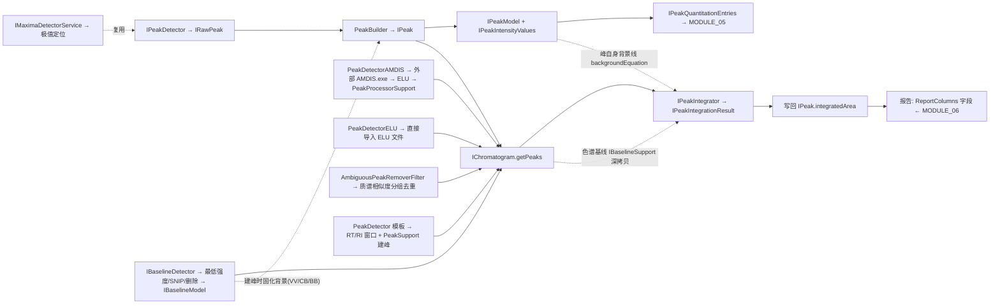

# MODULE_04 — Peak Model（峰模型层）★ 重点

> **状态：🟡 分析中（峰数据模型 ✅、一阶导数检测全链含基类/阈值/归一化 ✅、AMDIS/ELU 桥接 ✅、模板峰检测 ✅、基线检测/峰积分实现 ✅）**
> 这是自研 CDS 算法部分的核心参考。**严格遵守：✅ 源码确认 vs ⚠️ 推测，不许混。**

---

## 1. 峰的数据模型（✅ 全部源码确认）

### 1.1 IPeak（文件 `.fetch/sources/model/IPeak.java`，包 `org.eclipse.chemclipse.model.core`）

```text
IPeak extends ITargetSupplier, IClassifier, ISignal
```

| 成员 | 签名 | 说明 |
|---|---|---|
| 峰模型 | `IPeakModel getPeakModel()` | ★ 峰几何与强度分布全在 PeakModel |
| 模型描述 | `getModelDescription()` / `set` | "TIC"（全离子）/"XIC"（部分离子）或如 "+199-70" |
| 峰类型 | `getPeakType()` / `set` | **PeakType 枚举：BB 基线-基线、BV 基线-谷、…** |
| 隐藏峰提示 | `getSuggestedNumberOfComponents()` | 肩峰/隐藏峰数量提示 |
| 积分结果 | `getIntegratedArea()` / `setIntegratedArea(List<IIntegrationEntry>, desc)` / `getIntegrationEntries()` | 面积 + 分离子积分项 |
| 积分器名 | `getIntegratorDescription()` | 记录谁积的分 |
| 检测器名 | `getDetectorDescription()` | 记录谁检出的峰 |
| 积分约束 | `getIntegrationConstraints()` | 如 LEAVE_PEAK_AS_IT_IS（肩峰保护） |
| 定量项 | `getQuantitationEntries()` / `add/remove` | `IQuantitationEntry`（MODULE_05） |
| 内标 | `getInternalStandards()` / `addInternalStandard` | `IInternalStandard`（MODULE_05） |
| 定量器名 | `getQuantifierDescription()` | 记录谁算的定量 |
| 有效/删除 | `isActiveForAnalysis()` / `isMarkedAsDeleted()` | 分析参与标志 |
| 排序 | `COMPARATOR_RT_MAX` / `COMPARATOR_RT_START` | 按峰最大 RT / 起始 RT 排序 |
| ISignal | `getX()`=峰最大RT，`getY()`=峰丰度+背景丰度（默认实现） | 通用信号视图 |
| 临时数据 | `getTemporaryData()` / `set` | 不保存 |
| 定量引用 | `getQuantitationReferences()` | 交叉定量引用 |

### 1.2 IPeakModel（文件 `.fetch/sources/model/IPeakModel.java`）

`IPeakModel extends IPeakModelStrict, Serializable`，`MINIMUM_SCANS = 3`

| 几何量 | 签名 | 说明 |
|---|---|---|
| 峰起止 | `getStartRetentionTime()` / `getStopRetentionTime()` | 毫秒 |
| 峰顶 | `getRetentionTimeAtPeakMaximum()` | 毫秒 |
| 峰宽 | `getWidthBaselineTotal()` | 基线宽度(ms)；拐点法 = `getWidthBaselineByInflectionPoints()`（IPeakModel.java 注释中的 getWidthBaseline 为过时措辞）|
| 峰丰度 | `getPeakAbundance()` / `getPeakAbundance(rt)` | **0 基**（不含背景），按 RT 可查 |
| 背景丰度 | `getBackgroundAbundance()` / `getBackgroundAbundance(rt)` | 背景（基线）贡献 |
| 图形用 | `getPeakAbundance(rt) + getBackgroundAbundance(rt)` | 源码注释明确：画图把两者相加 |
| 峰形 | `getLeading()` / `getTailing()` | 前伸/拖尾因子（=1 理想） |
| 梯度角 | `getGradientAngle()` | 背景随时间增/减 |
| 百分比基线 | `getPercentageHeightBaselineEquation(float height)` | 0–1 高度百分比处的基线方程 |
| 扫描 | `getNumberOfScans()` / `getPeakMaximum()`(IScan) / `getPeakScan(rt)`(拷贝) | 按 RT 取扫描副本 |
| 强度 | `getIntensity(rt)` | 任意 RT 处强度 |
| 峰顶方程 | ✅ `getRetentionTimeAtPeakMaximumByInflectionPoints()` | 用拐点方程求峰顶（两拐点直线交点）|

> **拐点方程法（✅ 本机源码确认：`org.eclipse.chemclipse.model/core/AbstractPeakModelStrict.java` + `IPeakModelStrict.java` + `implementation/PeakModel.java`）：**
> `IPeakModel.java` 注释中提到的 `getWidthBaseline()` **并不存在**——实际方法是 `getWidthBaselineByInflectionPoints()`（IPeakModel.java 的注释措辞过时，源中未命名该方法）。拐点方程族：`areInflectionPointsAvailable / calculateIntersection / getPeakAbundanceByInflectionPoints / getWidthBaselineByInflectionPoints / getWidthByInflectionPoints(height) / getRetentionTimeAtPeakMaximumByInflectionPoints / getPercentageHeightBaselineEquation` ✅
> 峰不是数学函数（无解析式），**拐点方程 = 峰形上斜率最陡的上升段/下降段所在直线**：`calculateInflectionPointEquations` → `peakIntensityValues.calculateIncreasing/DecreasingInflectionPointEquation(peakAbundance)`；两直线交点即峰顶（x=RT，y=峰高）✅
> `PeakModel`（model.implementation）构造**默认 strictModel=true**，拐点方程计算失败时 `AbstractPeakModel.validateStrictModel` 自动回退 strictModel=false（改用强度表法计算拖尾）✅
> `getPercentageHeightBaselineEquation(height)` = 水平线 `y = peakAbundance×height`（峰与背景分离，无需斜移基线）✅

> **`getSuggestedNumberOfComponents()`（✅ IPeak.java）：** 返回假设的隐藏峰（肩峰）数量；无提示时返回 0。由峰检测/标识阶段写入，用于指导后续积分（配合 IntegrationConstraints.LEAVE_PEAK_AS_IT_IS 语义）。

### 1.3 IPeakIntensityValues（文件 `.fetch/sources/model/IPeakIntensityValues.java`）

**峰强度分布的规范存储：`NavigableMap<Integer, Float>`（RT[ms] → 相对强度[0–100%]）**

- `MAX_INTENSITY = 100.0f`（100%）
- `addIntensityValue(rt, relativeIntensity)`：相对峰最大值的百分比，越界跳过，重复覆盖
- `getHighestIntensityValue()` → Map.Entry（峰顶）
- `getIntensityValue(rt)`：`floorEntry()` 语义（≤ 给定 RT 的最近点）
- `normalize()`：归一化到 MAX_INTENSITY
- 峰值绝对丰度 = 相对强度% × 峰最大绝对丰度（源码注释给出换算示例）✅

### 1.4 积分约束 IntegrationConstraints（✅ 全源码确认）

- `IPeak.getIntegrationConstraints()` 返回 `IIntegrationConstraints`（`.fetch/sources/model/IPeak.java`）✅
- **枚举值集（✅ `org.eclipse.chemclipse.model/model/support/IntegrationConstraint.java`）：仅一个 `LEAVE_PEAK_AS_IT_IS`** —— 语义=不设新基线、不做任何校正；由积分器决定是否遵守 ✅
- **实现（✅ `model/support/IntegrationConstraints.java` + `IIntegrationConstraints.java`）**：内部 `HashSet<IntegrationConstraint>`；接口 `add / remove / removeAll / hasIntegrationConstraint` ✅
- **梯形积分器遵守此约束**（✅ `trapezoid/processor/PeakIntegrator.calculateBaselineCorrectedPeakArea`：`if(!peak.getIntegrationConstraints().hasIntegrationConstraint(IntegrationConstraint.LEAVE_PEAK_AS_IT_IS))` 才执行基线校正）✅
- 典型场景（✅ IPeak.java 注释）：峰上检测出肩峰后，不希望积分器为肩峰另设基线/校正 → 打上 `LEAVE_PEAK_AS_IT_IS` 标记，已实现该约束的积分器将按原样积分 ✅

## 2. 峰检测引擎

### 2.1 接口与支撑类型

| 类型 | 包 | 说明 |
|---|---|---|
| `IPeakDetector` | org.eclipse.chemclipse.chromatogram.peak.detector.core | `validate(selection, settings, monitor)` |
| `IRawPeak` | ...peak.detector.support | 原始峰：`getStartScan() / getMaximumScan() / getRetentionTimeAtMaximum() / getStopScan()` |
| `Threshold` | ...peak.detector.model | 枚举 OFF/LOW/MEDIUM/HIGH(1–4) |
| `IPeakDetectorCSD` | org.eclipse.chemclipse.chromatogram.csd.peak.detector.core | 检测器特异接口（`detect(...)`） |
| `PeakBuilderCSD` | org.eclipse.chemclipse.csd.model.core.support | 从扫描区间构建正式峰 |

### 2.2 一阶导数检测算法（文件 `.fetch/sources/firstderivative/PeakDetectorCSD.java`，✅ 完整读取）

类：`org.eclipse.chemclipse.chromatogram.csd.peak.detector.supplier.firstderivative.core.PeakDetectorCSD extends BasePeakDetector`

```text
detect(selection, settings, monitor)
 ├─ validate(...)                                  // 空校验 → IProcessingInfo
 ├─ [可选] NoiseChromatogramSupport.getNoiseSegments // 噪声段切分，逐段检测
 ├─ detectPeaks(...)
 │   ├─ getFirstDerivativeSlopes(selection, windowSize)
 │   │    ├─ new TotalScanSignals(selection)        // 取选择区总信号
 │   │    ├─ TotalScanSignalsModifier.normalize(signals, NORMALIZATION_BASE) // 归一化
 │   │    ├─ 逐相邻扫描: 斜率 = (p2.y-p1.y)/(p2.x-p1.x) → FirstDerivativeDetectorSlope
 │   │    └─ [windowSize≠0] slopes.calculateMovingAverage(windowSize)  // 斜率滑动平均
 │   ├─ getRawPeaks(slopes, threshold, monitor)     // ★ 阈值判定出 IRawPeak 列表（基类 BasePeakDetector，见 2.2.4）
 │   └─ extractPeaks(rawPeaks, chromatogram, settings)
 │        ├─ [VV+优化基线] optimizeBaseline(): 
 │        │    用 start/stop 两点建 LinearEquation 背景线，
 │        │    边界向峰内移动直到 signal < backgroundEquation.calculateY(rt)
 │        ├─ switch(detectorType): BB→PeakBuilderCSD.createPeak(chrom, scanRange, PeakType.BB)
 │        │                       CB→PeakType.CB   默认→PeakType.VV
 │        ├─ isValidPeak: peak != null && S/N >= minS/N
 │        └─ peak.setDetectorDescription("FirstDerivative")
 └─ chromatogram.getPeaks().addAll(peaks); chromatogram.setDirty(true)
```

**算法本质（✅ 源码）：**
1. 对总信号（TIC 或单通道）逐扫描求一阶差分斜率
2. 可选斜率移动平均平滑（windowSize）
3. 斜率过阈值 → 检测到峰的开始/结束 → 得 IRawPeak（start/max/stop scan）
4. 峰顶 = 斜率首次由正转负处（一阶导数过零，见 2.2.4）；峰边界可按基线方程优化（VV 时）
5. 按 DetectorType 设定峰型 BB/CB/VV，S/N 过滤
6. 直接写入 `chromatogram.getPeaks()` 并打脏标记

#### 2.2.1 斜率数据结构（✅ 全链源码确认）

文件（本机源码）：
- `.fetch/chemclipse-src/plugins/org.eclipse.chemclipse.chromatogram.peak.detector/src/org/eclipse/chemclipse/chromatogram/peak/detector/support/DetectorSlopes.java`（**基类**，旧文档 ❓ 已抓取）
- `...xxd.peak.detector.supplier.firstderivative/.../support/FirstDerivativeDetectorSlopes.java` + `FirstDerivativeDetectorSlope.java` + 接口

- **单斜率点 FirstDerivativeDetectorSlope**（✅）：`extends DetectorSlope implements IFirstDerivativeDetectorSlope`（纯标记类，构造器透传）
  - `DetectorSlope extends Slope implements IDetectorSlope`：字段 `private int retentionTime`（**该差分段起始扫描的 RT，ms**）+ 继承自 `Slope` 的 `private double slope`
  - 构造器 `(IPoint p1, IPoint p2, int retentionTime)`：`slope = Equations.calculateSlope(p1,p2)` = **(p2.y-p1.y)/(p2.x-p1.x)**（`numeric/equations/Equations.calculateSlope`，x 分母==0 时斜率为 0）✅
- **容器 DetectorSlopes extends IDetectorSlopes**（✅ 本机源码）：
  - 字段：`List<IDetectorSlope> slopes` + `int startScan / stopScan`（**1 基扫描号区间**）
  - 构造器 1：`DetectorSlopes(ITotalScanSignals)` → `this(getStartScan(), getStopScan()-1)`：**stop = 信号 stop - 1**（N 个信号点 → N-1 个差分对）✅
  - 构造器 2（protected）：`DetectorSlopes(int startScan, int stopScan)`：预分配 `amount = stop-start+1` 的 ArrayList ✅
  - `FirstDerivativeDetectorSlopes(signals)` → `super(signals)`；`FirstDerivativeDetectorSlopes(Collection<?>)` → `super(0, size-1)`（旧文档两构造器 ✅ 保持）——实际数据填充在 PeakDetectorCSD.getFirstDerivativeSlopes 完成
  - `getDetectorSlope(scan)`：**0 基列表下标 = scan - startScan**（1 基扫描号换算）；越界返回 null
  - `size()` = 斜率数量；`getStartScan/getStopScan` 返回扫描区间
- **滑动平均 calculateMovingAverage(windowSize)**（✅ 基类实现，双重确认）：
  - `windowSize == 0` → **直接 return（关平滑）**：调用侧 `if(windowSize != 0)`（PeakDetectorCSD/MSD/WSD）+ 基类首行 `if(windowSize == 0) return;` 双保险 ✅
  - `slopes.size() < windowSize` → return（不动）
  - `diff = windowSize/2`；对 i ∈ [diff, size-diff) 取窗口 `[i-diff, i-diff+windowSize)` 求均值写回 `slopes.get(i)`，**首尾 diff 个斜率保持原值**（居中滑动平均，无边界填充）
- **Savitzky-Golay 平滑**（✅ 基类另有 `calculateSavitzkyGolaySmooth(windowSize)`：ORDER=3、DERIVATIVE=0 调 `SavitzkyGolayFilter`；**一阶导数检测流水线未调用它**，仅模板预处理链用到 S-G）

#### 2.2.2 斜率计算细节（✅ PeakDetectorCSD.getFirstDerivativeSlopes）

- 静态公有方法：`public static IFirstDerivativeDetectorSlopes getFirstDerivativeSlopes(IChromatogramSelectionCSD chromatogramSelection, int windowSize)` ✅
- 对 `signals` 先 `TotalScanSignalsModifier.normalize(signals, NORMALIZATION_BASE)` 归一化 ✅
- **`NORMALIZATION_BASE = 100000.0f`**（✅ `BasePeakDetector.java`：`protected static final float NORMALIZATION_BASE = 100000.0f;`；WSD 变体在 `PeakDetectorWSD` 本地重复定义同值 100000.0f）
- **`TotalScanSignalsModifier.normalize(signals, base)`**（✅ `org.eclipse.chemclipse.model/signals/TotalScanSignalsModifier.java`）：
  - `base < 1` → 直接返回；`max = signals.getMaxSignal()`；`factor = base / max`（max≠0 时）
  - 逐信号：`totalSignal = factor × 原值` → **段内峰值被缩放到 100000，相对形状不变**
  - 作用：斜率 Δy/Δx 与绝对丰度无关 → Threshold 的固定数值阈值可跨仪器/跨浓度普适 ✅
- 逐扫描：`s1 = signals.getTotalSignal(scan)`，`s2 = signals.getNextTotalScanSignal(scan)`（相邻对）✅
- 建点：`p1 = (s1.getRetentionTime(), s1.getTotalSignal())`，`p2 = (s2.getRetentionTime(), s2.getTotalSignal())` ✅
- 斜率对象：`new FirstDerivativeDetectorSlope(p1, p2, s1.getRetentionTime())` —— 第三个参数是**起始扫描的保留时间** ✅
- 遍历范围 `startScan ~ stopScan-1`，即信号点 N 个 → 差分对 N-1 个 ✅

#### 2.2.3 基线优化细节（✅ PeakDetectorCSD.optimizeBaseline / optimizeRightBaseline / optimizeLeftBaseline）

- 仅当 `DetectorType.VV` 且 `settings.isOptimizeBaseline()` 时执行（`isValleyOption()`）✅
- `optimizeBaseline(chromatogram, startScan, centerScan, stopScan)`：先右后左，返回新 ScanRange ✅
- `optimizeRightBaseline`（✅）：
  - 背景线 = 由 (startScan, stopScan) 两点 `Equations.createLinearEquation` 得到 LinearEquation
  - 从 stopScan 向 centerScan 递减扫描 i：若 `signal(i) < backgroundEquation.calculateY(rt_i)` 则 `stopScanOptimized = i`（**不 break**，持续取更内点，最终停在最靠近峰顶的低于背景线的扫描）
- `optimizeLeftBaseline`（✅）：
  - 初始方程同上（p1=startScan, p2=stopScan 两点线）
  - 从 startScan 向 centerScan 递增扫描 i：若低于背景线，则更新 `startScanOptimized = i`，**并立即以 (startScanOptimized, stopScan) 重建方程**（动态内缩重拟合）
- 结论：VV 峰边界被"背景线上方部分"决定，峰脚下凡低于两点连线的区域被裁掉 ✅

#### 2.2.4 BasePeakDetector.getRawPeaks —— 斜率 → 峰区间阈值判定（✅ 完整源码）

文件 `.fetch/chemclipse-src/plugins/org.eclipse.chemclipse.chromatogram.xxd.peak.detector.supplier.firstderivative/src/.../core/BasePeakDetector.java`（本机源码，旧文档 PK1/PK-I ❓ 已解决）。

常量：`NORMALIZATION_BASE = 100000.0f`；**`CONSECUTIVE_SCAN_STEPS = 3`**（连续斜率个数，核心判定参数）。

**Threshold → 数值阈值映射（✅ switch 硬编码）：**

| Threshold 枚举 | 数值阈值 |
|---|---|
| OFF | 0.0005 |
| LOW | 0.005 |
| MEDIUM（默认）| 0.05 |
| HIGH | 0.5 |

> 注意与 AMDIS ONSITE.INI 的档位值区分：`Threshold` 枚举自身的 getThreshold() 为 OFF=1/LOW=2/MEDIUM=3/HIGH=4，这只是 UI 档位；**一阶导数检测用的数值阈值是上表**。

**完整算法（可照搬伪代码）：**

```text
getRawPeaks(slopes, thresholdSetting, monitor):
  threshold = 按上表映射
  size = slopes.size()
  scanOffset = slopes.getStartScan() - 1      # 斜率表 ↔ 色谱扫描号的换算（选择区非从 1 开始也成立）
  limit = size - CONSECUTIVE_SCAN_STEPS       # = size - 3
  for i = 1 .. limit:                         # i 是"斜率表内 1 基扫描序号"，真实下标 = i-1
      peakStart   = detectPeakStart(slopes, i, scanOffset, threshold)
      peakMaximum = detectPeakMaximum(slopes, peakStart, scanOffset)
      peakStop    = detectPeakStop(slopes, peakMaximum, scanOffset)
      i = peakStop                            # ★ 下一峰从本峰 stop 续扫（逐峰推进）
      rawPeak = new RawPeak(peakStart+scanOffset, peakMaximum+scanOffset, peakStop+scanOffset)  # 换算回色谱扫描号
      if isValidRawPeak(rawPeak): rawPeaks.add(rawPeak)
  return rawPeaks

detectPeakStart(slopes, startScan, scanOffset, threshold):
  peakStart = size - 1                        # 默认值=表尾（表示未找到）
  for scan = startScan .. size-3:
      if slopes.getDetectorSlope(scan+scanOffset).getSlope() > threshold:
          values[j] = slopes.getDetectorSlope(scan+j+scanOffset).getSlope(), j=0..2
          if 全部 values 都 > threshold  且  values 严格递增:    # Evaluation.valuesAreGreaterThanThreshold + valuesAreIncreasing
              peakStart = scan; break
  return peakStart
  # 语义：峰起 = 连续 3 个斜率同时超阈值 且 加速上升（3 阶意义拐点的上升支）

detectPeakMaximum(slopes, startScan, scanOffset):
  peakMaximum = startScan                     # 默认=起点
  for scan = startScan .. size-3:
      if slopes.getDetectorSlope(scan+scanOffset).getSlope() < 0.0:
          peakMaximum = scan; break
  return peakMaximum
  # ★ 峰顶 = 斜率【首次由正转负】处（一阶导数过零 = 真实峰顶，不是斜率最陡处）

detectPeakStop(slopes, startScan, scanOffset):
  peakStop = size - CONSECUTIVE_SCAN_STEPS    # 默认=size-3
  for scan = startScan .. size-3:
      if slopes.getDetectorSlope(scan+scanOffset).getSlope() > 0.0:
          peakStop = scan; break
  return peakStop
  # 峰止 = 峰顶之后斜率【首次回正】处（越过谷底进入下一峰上升沿即截断）

isValidRawPeak(rawPeak):
  width = stopScan - startScan + 1
  return width >= IPeakModel.MINIMUM_SCANS (3)
```

**要点（✅ 全部源码级确认）：**
1. **峰顶定位**：不是"斜率最陡处"，而是**一阶导数第一次过零（<0）**的扫描 → 真正的 apex。旧文档"峰顶 = 区间内最高点"表述修正为"峰顶 = 斜率过零处"（导数法的天然峰顶；与 IRawPeak.maximumScan 一致）。
2. **最小面积/高度过滤不存在**：getRawPeaks 唯一过滤是 **宽度 ≥ 3 扫描**（isValidRawPeak）。高度/面积/S-N 过滤在更下游的 extractPeaks/isValidPeak（见 2.2.5）与积分环节。
3. **相邻峰截断**：`i = peakStop` + "斜率回正即截断" → 紧邻峰的前峰终点 = 后峰起点附近（肩峰处理粗糙，靠后续 LEAVE_PEAK_AS_IT_IS / 积分器兜底）。
4. 未找到峰的退化：detectPeakStart 返回 size-1、stop 返回 size-3 时 `RawPeak` 构造器因 `start<max<stop` 不成立而整体为 0，宽度 1 < 3 → 被过滤，不会产生伪峰。
5. `Evaluation.valuesAreIncreasing`：严格递增（`d > prev`，首值须 > Double.MIN_VALUE）；`valuesAreGreaterThanThreshold`：`d > threshold`（严格大于）。
6. 循环 i 从 1 开始：`getDetectorSlope(1+scanOffset)` = 下标 0（首个斜率）。选择区从 850 开始时 scanOffset=849，i=1 → 850 → 下标 0，与源码注释一致。

#### 2.2.5 从 IRawPeak 构造 IPeak（✅ PeakBuilderCSD + PeakModel 全链，含 S/N 过滤）

`extractPeaks(rawPeaks, chromatogram, settings)`（CSD，✅ PeakDetectorCSD）：
```text
for rawPeak:
    scanRange = (rawPeak.getStartScan(), rawPeak.getStopScan())
    if DetectorType.VV && optimizeBaseline: scanRange = optimizeBaseline(...)   # 2.2.3 两点线性背景内缩
    switch detectorType:
        BB → PeakBuilderCSD.createPeak(chrom, scanRange, PeakType.BB)
        CB → PeakBuilderCSD.createPeak(chrom, scanRange, PeakType.CB)
        默认→ PeakBuilderCSD.createPeak(chrom, scanRange, PeakType.VV)
    if isValidPeak(peak, settings):                     # 见下 S/N 过滤
        peak.setDetectorDescription("FirstDerivative"); peaks.add(peak)
```
- MSD 变体用 `PeakBuilderMSD.createPeak(chrom, scanRange, peakType, traces, MarkedTraceModus)`（按 filterIons 组逐组检测，EXCLUDE/INCLUDE 模式）；WSD 变体 **CB→当作 VV**（注释：WSD 无真实基线），`createPeak(..., false/true, ...)` 第二参 = 是否含背景。

**PeakBuilderCSD.createPeak(chromatogram, scanRange, peakType)**（✅ 完整方法体）：
1. 取 scanRange 内全部总扫描信号 totalScanSignals
2. **背景丰度 BackgroundAbundanceRange**（`BackgroundAbundanceRange(start, stop)`）：
   - `VV` → (startScan 信号强度, stopScan 信号强度)：峰两端实测强度即背景
   - `CB` → `chromatogram.getBaselineModel().getBackground(startRT / stopRT)`：用色谱图基线模型
   - 其余（BB 等）→ `base = min(起,止)`，`(base, base)`：取较低端作水平背景
3. `backgroundEquation` = 过 (startRT, startBg) 与 (stopRT, stopBg) 的线性方程（`Equations.createLinearEquation`）
4. 深拷贝信号，逐扫描 `adjustedSignal = max(0, signal − backgroundEquation.calculateY(rt))`，再整段 `TotalScanSignalsModifier.normalize(..., MAX_INTENSITY=100)` → **峰强度分布表 peakIntensityValues（NavigableMap<RT, 相对强度%>）**（背景扣除 + 0–100% 归一化）
5. **峰顶扫描** = 段内最大信号扫描；`ScanCSD(其RT, 其信号 − 背景(该RT))` 作 peakMaximum（**纯峰高，0 基不含背景**）
6. `PeakModelCSD(peakMaximum, peakIntensityValues, startBg, stopBg)` → `ChromatogramPeakCSD(peakModel, chromatogram)`

**峰模型几何来源（✅ `model/core/AbstractPeakModel.java`）：**
- `getStartRetentionTime / getStopRetentionTime` = **强度表首/末键**（即 IRawPeak 起止扫描的 RT）
- `getRetentionTimeAtPeakMaximum` = 强度表最高键（= peakMaximum 扫描的 RT）
- `getPeakAbundance()` = `peakMaximum.getTotalSignal()`（纯丰度）；`getPeakAbundance(rt)` = 峰高 × 相对强度%/100
- `getBackgroundAbundance(rt)` = `backgroundEquation.calculateY(rt)`（线性背景）；绘图时两者相加
- strictModel 默认 true（拐点方程，见 1.2），失败回退

**S/N 过滤（✅ isValidPeak）：**
- CSD/MSD：`peak != null && peak.getSignalToNoiseRatio() >= settings.getMinimumSignalToNoiseRatio()`（默认 0 → 恒过）
- WSD：**仅 `peak != null`**（注释："Noise calculation needs to be adjusted for WSD chromatograms"，S/N 暂不启用）
- **检测流程不设置 IntegrationConstraints**（肩峰保护 LEAVE_PEAK_AS_IT_IS 由峰评审/模板等其它环节写入，见 1.4）

**检测参数设置默认值（✅ `settings/PeakDetectorSettingsCSD.java` + MSD）：**

| 参数 | CSD 默认 | MSD 额外 |
|---|---|---|
| threshold | MEDIUM | 同 |
| detectorType | VV | 同 |
| minimumSignalToNoiseRatio | 0 | 同 |
| windowSize（滑动平均）| **5**（IntSettings 校验：0–45 奇数含 0）| 同 |
| useNoiseSegments | false | 同 |
| optimizeBaseline(VV) | false | 同 |
| filterIons / filterMode | — | 空 / EXCLUDE；useIndividualTraces=false（逐离子组检测，检出加 classifier "Trace N"）|

### 2.3 AMDIS 外部程序桥（✅ 全链源码确认）—— 峰检测器家族之一

> ⚠️ 重要：**msd.peak.detector.supplier.amdis 不是原生 Java 算法**，而是调用外部 AMDIS.exe 去卷积后再导入结果。完整桥接链如下。

#### 2.3.1 PeakDetectorAMDIS → AmdisIdentifier（✅ 均本机源码）

`core/PeakDetectorAMDIS.java`（包 `net.openchrom...supplier.amdis.core`，extends `AbstractPeakDetectorMSD`）：

```text
detect(selection, settings, monitor)
 ├─ validate(...)
 ├─ settings instanceof SettingsAMDIS →
 │   new AmdisIdentifier().calculateAndSetDeconvolutedPeaks(selection, settings, monitor)
 │       ├─ 把当前色谱图导出为 CDF 临时文件：
 │       │   file = PreferenceSupplier.getDataFolder()/chromatogram.getName()
 │       │   ChromatogramConverterMSD.convert(file, chromatogram, CDF.CONVERTER_ID)
 │       ├─ executeAMDIS(fileChromatogram, settings, parser)
 │       │   ├─ amdisApplication = 安装目录 + "/" + "AMDIS32$.exe"（PreferenceSupplier.AMDIS_EXECUTABLE）
 │       │   ├─ filePath = getAmdisCompatibleFilePath(...)
 │       │   │     Windows: amdisTmpPath/<名>.CDF
 │       │   │     Wine:    把 /.wine/dosdevices/ 或 /drive_c/ 换算成 C:\tmp\... 风格
 │       │   ├─ runtimeSupport = RuntimeSupportFactory.getRuntimeSupport(application, filePath)
 │       │   ├─ runtimeSupport.getAmdisSupport().modifySettings(settings.getOnsiteSettings())  // 改写 ONSITE.INI
 │       │   ├─ runtimeSupport.executeRunCommand()      // 启动 AMDIS 批处理（基类实现，本机无 → ❓）
 │       │   ├─ parser.parse(monitor)                   // 等待并解析 ELU/FIN/RES
 │       │   └─ finally executeKillCommand()            // 清理进程
 │       └─ PeakProcessorSupport.insertPeaks(selection, peaks.getPeaks(), settings, ...)
 └─ chromatogram.setDirty(true)
```

**命令行参数来源（✅）：**
- 可执行文件：`PreferenceSupplier.getInstallationFolder() + File.separator + PreferenceSupplier.AMDIS_EXECUTABLE`（`AMDIS32$.exe`）✅
- 参数列表（✅ RuntimeSupportFactory.getRuntimeSupport）：`[chromatogram路径, "/S"]`，`/S` = IAmdisSupport.PARAMETER（Simple Analysis 批处理模式）✅；注释给出成品命令行示例：`wine AMDIS32\$.exe C:\\tmp\\C2.CDF /S` ✅
- 所有去卷积参数（m/z 范围、阈值、峰宽、分辨率、灵敏度等）**不通过命令行**，而是改写 AMDIS 的 `ONSITE.INI`（✅ AmdisSupport.modifySettings：读安装目录 ONSITE.INI → 逐行 `key=value` → 命中的 key 用 SettingsAMDIS 生成的值替换 → 写回）。

**SettingsAMDIS → ONSITE.INI 键映射（✅ SettingsAMDIS.getOnsiteSettings + IOnsiteSettings）：**

| SettingsAMDIS 字段（默认值） | ONSITE.INI 键 | 值 |
|---|---|---|
| lowMzAuto (true) | LOWMZAUTO | 1/0 (Option.YES/NO) |
| startMZ (35) | LOMASS | 1–1000 |
| highMzAuto (true) | HIGHMZAUTO | 1/0 |
| stopMZ (600) | MXMASS | 1–1000 |
| omitMz (false) | OMITMZ | 1/0 |
| omitedMZ ("0 18 28") | OMITEDMZ | 0=TIC；空格分隔 m/z |
| useSolventTailing (true) | USESTAIL | 1/0 |
| solventTailingMZ ("84") | STAILMZ | 默认 84 |
| useColumnBleed (true) | USECOLUMNBLEED | 1/0 |
| columnBleedMZ ("207") | BLEEDMZ | 默认 207 |
| threshold (MEDIUM) | THRESHOLD | ✅ **一致**：`Threshold` 枚举（peak.detector/model/Threshold.java）为 OFF=1/LOW=2/MEDIUM=3/HIGH=4，与 AMDIS 注释 High=4/Med=3/Low=2/Off=1 吻合（旧文档判为"不一致"有误）。注意：这是 ONSITE.INI 的档位值，与一阶导数检测的数值阈值 0.0005~0.5 无关 |
| componentWidth (12) | PEAKWIDTH | 12–32 (MIN/MAX_PEAK_WIDTH) |
| adjactentPeakSubtraction (NONE) | DECLEVEL | Two=0/One=1/None=2（值反序，AMDIS 设计）|
| resolution (MEDIUM) | RESOLUTION | High=0/Med=1/Low=2 |
| sensitivity (MEDIUM) | SENSIT | VeryHigh=60/High=30/Med=10/Low=3/VeryLow=1 |
| shapeRequirements (HIGH) | PEAKSHAPE | High=2/Med=1/Low=0 |
| 固定值 | SCANDIR / INFILE / INSTYPE | None=0 / CDF=2 / Quadrupole=0 |

**AMDIS 输出文件与解析（✅ AMDISParser.java）：**
- 输出文件与色谱图同名、换扩展名：`<色谱图名>.CDF → .ELU（峰）+ .FIN（库结果）+ .RES（报告）` ✅
- `waitForFile(eluFile, 60s)` 等文件出现 → `waitForFileComplete(eluFile, 5min)` 轮询文件大小稳定（判定写完）✅（超时参数来自系统属性 `chemclipse.amdis.timeout.elu/complete/watch.window`，默认 60/5/1）✅
- `PeakConverterMSD.convert(eluFile, "org.eclipse.chemclipse.msd.converter.supplier.amdis.peak.elu")` → `IPeaksMSD` ✅
- finally 删除 ELU/FIN/RES 临时文件 ✅
- ❓ ELU 二进制格式解析在 ChemClipse：`chemclipse/plugins/org.eclipse.chemclipse.msd.converter.supplier.amdis/src/org/eclipse/chemclipse/msd/converter/supplier/amdis/io/ELUReader.java`（+ `converter/elu/ELUPeakImportConverter.java`）

**OS 运行时工厂与命令行（✅）：**
- `RuntimeSupportFactory`：Windows → `WindowsSupport`；Mac → `MacWineSupport`；其余 → `LinuxWineSupport` ✅
- `WindowsSupport`（extends `AbstractWindowsSupport`）：
  - `executeOpenCommand()`：`ProcessBuilder("AMDIS_32.exe")`（把 AMDIS32$.exe 替换成 GUI 版）✅
  - `executeKillCommand()`：`taskkill /f /IM AMDIS_32.exe`（仅当 `amdisSupport.validateExecutable()` 通过，即可执行文件名以小写 "amdis" 开头）✅
  - `executeRunCommand()` 在抽象基类（本机无 → ❓）；批处理调用路径由构造参数 `[chromatogram, "/S"]` 决定 ✅
- `LinuxWineSupport`：`pkill -f AMDIS`；`wine start` + WINEPREFIX 环境变量；执行前 sleep 4000ms ✅

#### 2.3.2 PeakDetectorELU：把第三方 ELU 结果文件转成 IPeak（✅ 全链源码确认）

`core/PeakDetectorELU.java`（本机源码）——**不调外部程序**，直接导入用户已用 AMDIS 跑好的 ELU 文件：

```text
detect(selection, settings, monitor)
 ├─ validate(...)
 ├─ settings instanceof SettingsELU → SettingsELU.getResultFile()（*.elu，文件对话框）
 ├─ PeakProcessorSupport.extractEluFileAndSetPeaks(selection, file, settings, monitor)
 └─ chromatogram.setDirty(true)
```

`support/PeakProcessorSupport.java`（✅ 本机源码）核心流程：

- `PeakConverterMSD.convert(file, "org.eclipse.chemclipse.msd.converter.supplier.amdis.peak.elu")` 把 ELU 解析成 `IPeaksMSD` ✅
- `insertPeaks(...)`（逐峰，✅）：
  1. 从 `peakModel.getTemporarilyInfo(...)` 取 ELU reader 写入的 `IPeakReader.TEMP_INFO_START_SCAN / STOP_SCAN / MAX_SCAN` ✅
  2. **三个扫描号全部 +1** —— 源码注释原文："There seems to be an offset of 1 scan. Why? No clue ..."（AMDIS 扫描号与 OpenChrom 差 1）✅
  3. `new ChromatogramPeakMSD(peakModelMSD, chromatogram)` 构造色谱峰（**峰模型、峰顶、峰形、强度分布直接沿用 ELU reader 建好的 IPeakModelMSD**）✅
  4. `setDetectorDescription("AMDIS (Extern)")` ✅
  5. `isValidPeak`：色谱图边界（start/stop RT 不越界）、selection 边界、S/N ≥ minSignalToNoiseRatio、leading/tailing ∈ [min,max]（默认 0.1–2.0）✅
  6. 预检 `startScan>0 && stopScan>startScan && maxScan>startScan` → **用色谱图真实扫描 RT 列表 `replaceRetentionTimes()` 覆盖峰模型 RT**（关键：外部峰对齐到本色谱图的 RT 网格）✅
  7. `ModelPeakOption` 过滤：非 `ALL` 时，峰 `getTemporaryData()`（header）须含 `"MP"+value` 标记（AMDIS 模型峰标记 MP1/MP2/MP3）✅
  8. 通过则 `chromatogram.getPeaks().add(peak)` ✅

> **ELU→IPeak 模型映射要点（✅）：** 模型描述/峰类型在 PeakProcessorSupport 中**未显式设置**（❓ 由 ChromatogramPeakMSD 构造/ELU reader 决定，ChemClipse 侧待抓取）；保留时间被替换为色谱图扫描 RT；扫描区间来自 ELU reader 的 temporarilyInfo 并 +1 偏移。

#### 2.3.3 后处理：AmbiguousPeakRemoverFilter（重叠峰去重，✅ 全链源码确认）

`filter/AmbiguousPeakRemoverFilter.java`（MSD 专用过滤器）：

- 流程（✅ filterDuplicatePeaks）：
  1. 按保留时间排序（基于提取质谱 RT）✅
  2. 相邻峰 RT 差 < `rtmaxdistance`（分钟，默认 0.05）→ 归入候选组 ✅
  3. 组内两两比较质谱：`MassSpectrumComparator.getMassSpectrumComparator(comparatorID)`，默认比较器 ID `org.eclipse.chemclipse.chromatogram.msd.comparison.supplier.distance.cosine`（余弦距离）；`matchFactor/100 > minmatchfactor(0.95)` 则建 `PeakGroup` ✅
  4. 相交的组 `merge` 合并 ✅
  5. 每组用 `AreaComparator`（按 integratedArea）或 `SNRComparator`（按 S/N）选**最大峰**，删除其余 ✅
- 选择方法：`SelectionMethod.SNR`（色谱峰，默认）或 `AREA` ✅
- 结构：`PeakGroup<T>` = `Map<Integer,T>`（峰→组内下标），`intersects`/`merge` 按下标 ✅
- 用途：AMDIS 去卷积常对同一组分产出多个候选峰，此过滤器在保留时间窗内按质谱相似度聚类并只留一个 ✅

#### 2.3.4 其他峰检测器（⚠️ 目录树确认存在，实现未读）

- `xxd.peak.detector.supplier.thirdderivative`：三阶导数检测器 —— ✅ 本版为**空实现占位**：`core/PeakDetector.detect` 直接 `return new ProcessingInfo<>()`，**不检出任何峰**（仅继承 `AbstractPeakDetectorMSD` 的校验骨架），无算法可移植
- `msd/csd/wsd.peak.detector.supplier.firstderivative`：各检测器家族的一阶导数变体
- `msd.peak.detector.supplier.amdis`：**OpenChrom 社区版 AMDIS** —— 实为**外部程序桥接**（`runtime/AmdisSupport` + OS 支持类 WindowsSupport/LinuxWineSupport，调外部 AMDIS.exe 再解析输出），**不是原生 Java 算法** ✅（结构确认；本版已在 2.3 全链读通）

### 2.4 模板峰检测（✅ 全链源码确认，net.openchrom.xxd.process.supplier.templates）

> 与一阶导数互补：**基于「RT/RI 窗口 + 峰型 + 过滤」的确定性峰定义**，不依赖信号阈值。典型用途：按已知保留时间建模板自动检出目标峰。

#### 2.4.1 设置模型（settings + model）

- `settings/PeakDetectorSettings`（✅）：字段仅一个 `detectorSettings` 字符串（`|` 分隔、`;` 分隔多条）；`getDetectorSettingsList()` 用 `PeakDetectorListUtil`+`PeakDetectorValidator` 解析出 `List<DetectorSetting>`。`DETECTOR_DESCRIPTION = "Template Peak Detector"`。实现 `IPeakDetectorSettingsCSD/WSD`（跨 CSD/MSD/WSD）。✅
- `settings/PeakDetectorDirectSettings`（✅）：直接模式 —— `traces`（空= TIC）、`detectorType`（默认 VV）、`optimizeRange`、`useExistingPeaks`、`useSelectedRange`（用已有峰/选择区自动造 RT 范围）。✅
- `model/DetectorSetting extends AbstractSetting`（✅）字段：
  - `peakType`（默认 `PeakType.VV`）；`isIncludeBackground() = peakType == VV`（VV 含背景）
  - `traces`（如 "103 104" 或 "103, 104, 108-110"；空= TIC）
  - `optimizeRange`（峰范围自动优化）
  - `referenceIdentifier`（参考峰名，用于**相对 RT** 定位）
  - `name` / `classifier`（检出后附加标识/分类）
  - `autoAdjustScanRange`（自动用峰检测器精调扫描范围）
  - `peakSelectionCriterion`（默认 HEIGHT_HIGHEST）、`peakSelectionChoice`（默认 FIRST，取第 1 个）
  - `autoAdjustDetectorRange`
- `model/AbstractSetting`（✅）：`positionStart/positionStop`（double）+ `positionDirective`（默认 RETENTION_TIME_MIN）；`MISSING_RETENTION_TIME=Integer.MIN_VALUE`、`FULL_RETENTION_TIME=0`；RT 换算：MS→round(value)，MIN→round(value × 60000)（⚠️ `IChromatogramOverview.MINUTE_CORRELATION_FACTOR`=60000 为推断），RI→经 `RetentionIndexMap` 换算。✅
- `model/DetectorType`（✅ templates 专用枚举）：VV(Valley)/BB(Baseline)/CB(Chromatogram Baseline)/MM(Manual)/DEFAULT；`translate()` → PeakType。
- **序列化格式**（✅ PeakDetectorValidator.values[0..10] + DetectorSettings.extractSetting）：
  `start | stop | peakType | traces | optimizeRange | referenceIdentifier | name | positionDirective | classifier | autoAdjustScanRange | autoAdjustDetectorRange`
  示例（✅ PeakDetectorListUtil.EXAMPLE_MULTIPLE）：`10.52 | 10.63 | VV | 103, 104, 108-110 | true | Reference | Identification; 10.71 | 10.76 | BB | 105, 106 | false | `

#### 2.4.2 检测逻辑（peaks/PeakDetector + support/PeakSupport，✅）

`PeakDetector.detect`（实现 MSD/CSD/WSD 三接口）：
- 分两组处理：**无 referenceIdentifier 的先跑，有标识的后跑**（后者可引用前者刚检出的峰）✅
- `setPeakBySettings` → `PeakSupport.getRetentionTimeRange`：有参考峰则在其 start/stop RT 上**叠加**模板偏移（可负，允许模板峰在参考峰之前）；RI 模式经 RI map 换算 ✅
- `setPeakByRetentionTimeRange`：
  - RT → 扫描：`getScanNumber`，越界裁剪 ✅
  - `autoAdjustDetectorRange && deltaScan<=2` → 改用全色谱图范围；`deltaScan > 2`（至少 3 扫描）才检测 ✅
  - `peakType == CB` → 从 `chromatogram.getBaselineModel().getBackground(startRT/stopRT)` 取起止背景强度，以 IntensityRange 建峰（MM/CB 模式）✅
  - 其他 → `extractPeakByScanRange(includeBackground=VV, optimizeRange, traces, ...)` ✅
  - 检出后按需加 `IIdentificationTarget`（name）与 classifier，`PeakSupport.addPeak` 按色谱类型插入 ✅

`PeakSupport.extractPeakByScanRange`（✅ 建峰与优化细节）：
- `optimizeRange` → `optimizeRange()`：**四分位中心法** —— 中间 1/2 区间找最大信号为 centerScan；左边界 = [startScan, center) 最小信号点；右边界 = (center, stopScan] 最小信号点 ✅
- `intensityRange == null` → `PeakBuilderCSD.createPeak(chromatogram, scanRange, includeBackground)` / MSD 用 `PeakBuilderMSD.createPeak(..., traces, MarkedTraceModus.EXCLUDE)`（离子从扫描中剔除模式）✅
- `autoAdjustScanRange` → `getScanRangeOptimizedByPeakDetector`：**内部复用一阶导数完整预处理链**（✅ processOptimizeChromatogram，模板与一阶导数的交叉验证证据）：
  - 复制色谱图（按 traces 提离子/高分辨/串联质谱）→ 零集滤波 → 扫描密度重采样（5 scans/s）→ **Savitzky-Golay 5 次**（order=2，width=5→13）→ **SNIP 基线**（iterations=175, windowSize=25）→ 基线扣除 → 去空扫描 → **一阶导数峰检测**（`DetectorType.CB`, minS/N=0, movingAverage=3, optimizeBaseline=false, Threshold.OFF, useNoiseSegments=true）→ **梯形积分**（includeBackground=false, useAreaConstraint=true）✅
  - 在模板窗口内按 `peakSelectionCriterion/choice` 选峰（HEIGHT/AREA 最高最低、RT 起止），裁剪 scanRange 回模板边界 ✅

### 2.5 IMaximaDetectorService（数值极值检测服务，✅ 接口 + ✅ 实现）

文件 `.fetch/sources/numeric/IMaximaDetectorService.java`（包 `org.eclipse.chemclipse.numeric.services`）：

```text
double[] calculate(double[] xValues, double[] yValues, IMaximaDetectorSettings maximaDetectorSettings)
```

- 用途（✅ 接口签名）：给定 x/y 值数组与设置，返回**所有极大值（峰顶/极值）的 x 位置数组**；配套 `getSettings()` 拿默认设置，`getId/getName/getDescription/getVersion` 为服务元数据
- **✅ 实现 FirstDerivativeMaximaService**（`...xxd.peak.detector.supplier.firstderivative/services/FirstDerivativeMaximaService.java`，本机源码）：
  - OSGi DS 服务组件（`@Component(service = IMaximaDetectorService.class)`）；`getId = "org.eclipse.chemclipse.chromatogram.xxd.peak.detector.supplier.firstderivative"`，名称 "Maxima Detector (First Derivative)"
  - `calculate(x[], y[], settings)`：x/y 长度不等 → 空数组；否则一阶差分 `derivatives[i] = y[i]−y[i−1]`（derivatives[0]=0），**极大值 = x[i] 其中 `derivatives[i] > 0 && derivatives[i+1] < 0`**（一阶差分符号翻转处）✅
  - 设置类 `FirstDerivativeMaximaSettings`（空实现，无字段）
- ⚠️ 与 getRawPeaks 的峰顶判定一致（都是一阶导数符号翻转），区别在接口形态（裸数组 + 服务注册）与不要求 3 连递增预条件

### 2.6 PeakRegionParameter（峰区域参数，✅ 本机源码）

文件 `openchrom/plugins/net.openchrom.xxd.base/src/net/openchrom/xxd/base/model/PeakRegionParameter.java`：

- 内部为 `List<IPoint>`（点按 X=RT 升序排序）✅
- `add/remove/clear`，`isValid() = size >= 3` ✅
- `getStart()` = 第一个点；`getStop()` = 最后一个点；`getProposedMaxima()` = 中间所有点（候选峰顶）✅
- 注意：类中**没有 startRT/stopRT 字段**，起止通过有序点集的首/尾表达；`IPoint` = (RT, 强度) ✅
- ⚠️ 用途推测：手工/半自动峰编辑时用 ≥3 点（起点、若干候选峰顶、终点）描述一个峰区域，供构建正式峰使用

## 3. 基线检测（✅ 本机源码全链确认）

### 3.1 基线数据模型（`org.eclipse.chemclipse.model`，包 `...model.baseline`）

#### 3.1.1 IBaselineSegment / BaselineSegment（✅）

文件 `.fetch/chemclipse-src/plugins/org.eclipse.chemclipse.model/src/org/eclipse/chemclipse/model/baseline/IBaselineSegment.java` + `BaselineSegment.java`

| 字段 | 说明 |
|---|---|
| `getStartRetentionTime()` / `getStopRetentionTime()` | 段起止 RT（ms）|
| `getStartBackgroundAbundance()` / `getStopBackgroundAbundance()` | 段两端背景丰度 |
| `getTrace()` | 通道（m/z / 波长；TIC 用 `TraceEmpty`）|
| `getBackgroundAbundance(rt)` | **任意 RT 的背景 = `Equations.createLinearEquation((startRT,startBG),(stopRT,stopBG)).calculateY(rt)`，即两点线性方程 y=mx+b** ✅ |

- 构造器保证 `startRT ≤ stopRT`（否则交换两 RT）✅
- **基线段 = (RT 范围 + 端点背景) + 两点线性插值**——这是全系统基线的统一表示 ✅

#### 3.1.2 IBaselineModel / BaselineModel（✅）

文件 `...model/baseline/IBaselineModel.java` + `BaselineModel.java`

- **存储**：`NavigableMap<Integer, Map<ITrace, IBaselineSegment>>`——**key = 段起点 RT**，内层按 trace 分（同一 RT 可有多通道基线）✅
- **添加**：
  - `addBaseline(startRT, stopRT, startBG, stopBG, validate)`：`startRT < stopRT` 才动作；`validate=true` → 先 `addBaselineChecked`（**removeBaselineSegments 切除冲突后**再加）；`false` → `addBaselineUnchecked` 直接加（调用方保证不重叠，SNIP 用 false）✅
  - `addBaseline(ITotalScanSignals)`：从首到尾逐相邻信号建段，**相邻点背景 = 信号值**（整条信号转基线段的便捷路径）✅
- **查询** `getBackground(rt)`：
  - rt 越界（< 色谱 startRT 或 > stopRT）→ `defaultBackgroundAbundance`（默认 0）✅
  - 否则 `baselineSegments.floorEntry(rt)` 取段：rt ≤ 段 stop → `segment.getBackgroundAbundance(rt)`（段内线性插值）✅
  - **rt 落在段外**（floor 段终点 < rt）且 `interpolate=true`（`defaultBackgroundAbundance=NaN` 时构造器置 true）→ 用 floor 段 stop 点 与 ceiling 段 start 点建 LinearEquation **外插** ✅
- **删除**：
  - `removeBaseline()` → 全清 ✅
  - `removeBaseline(startRT, stopRT)` → `removeBaselineSegments`：`removeMiddleSegments`（整段在区间内的删除）+ `cutSegmentInTwoParts`（被 [start,stop] 横穿的大段**一分为二**，裁剪点背景用 `getBackgroundAbundance` 求值）+ `cutSegmentBeginningPart/cutSegmentEndingPart`（边界段**截短残留**）✅
  - 剪段时若残余段首尾 RT 相等（1ms 级）会做 ±1ms 微调保证段有效 ✅
- `makeDeepCopy()`：逐段复制（积分设置深拷贝色谱基线用）✅

#### 3.1.3 色谱挂基线（✅ `model/core/AbstractChromatogram.java`）

- `IChromatogramBaseline`：`DEFAULT_BASELINE_ID = "Default"`；**一个色谱可持有多个命名基线模型**，含 `getBaselineIds() / getActiveBaseline() / setActiveBaseline(id) / removeBaseline(id)` ✅
- `AbstractChromatogram` 字段：`Map<String, IBaselineModel> baselineModelMap`（构造时预置 `new BaselineModel(this)` 于 Default）✅
- `getBaselineModel()`：返回 active id 的模型（无则懒建）——**基线归属色谱对象，多个基线检测器/手动编辑都可操作同一模型**（`xxd.baseline.detector/core/BaselineDetector.java` 类注释明确此设计）✅
- `removeBaseline(id)`：Default 不可删，删后自动切回 Default ✅

### 3.2 实际基线检测算法（三种供应商，全部 ✅ 本机源码）

门面：`xxd.baseline.detector/core/BaselineDetector.setBaseline(selection, settings, detectorId, monitor)` → 扩展点 `...baselineDetectorSupplier` 查实例 → 执行 → `chromatogram.setDirty(true)` ✅（`core/BaselineDetector.java`）

| 供应商 ID | 类 | 算法 |
|---|---|---|
| `org.eclipse.chemclipse.chromatogram.xxd.baseline.detector.impl.lowest` | `...baseline.detector/impl/BaselineDetector.java` | **最低信号平基线** |
| `org.eclipse.chemclipse.chromatogram.xxd.baseline.detector.supplier.snip` | `...edit.supplier.snip/core/BaselineDetector.java` | **SNIP 迭代峰裁剪** |
| `org.eclipse.chemclipse.chromatogram.xxd.baseline.detector.impl.delete` | `...baseline.detector/impl/BaselineDelete.java` | **删除**（全删/区间删）|

#### 3.2.1 最低强度法（✅ impl/BaselineDetector）

```text
setBaseline
 ├─ validate（基类 AbstractBaselineDetector：selection/色谱/settings 空校验 → IProcessingInfo）
 ├─ extractLowestIntensity：遍历 selection 扫描，取 min(scan.getTotalSignal())
 └─ intensity != 0 时：baselineModel.addBaseline(startRT, stopRT, intensity, intensity, false)
```

- 算法本质：**整选择区一条水平基线，高度 = 区间最低总信号**（validate=false，一次写入）✅
- 设置类 `DetectorSettings extends AbstractBaselineDetectorSettings`：**空壳，无参数** ✅

#### 3.2.2 SNIP 基线（✅ edit.supplier.snip/core/BaselineDetector）

- 设置 `settings/BaselineDetectorSettings.java`：`iterations` 默认 **100**（5–2000）、`windowSize` 默认 **5**（0–45 奇数含 0）、`specificTraces` 默认空 = TIC ✅
- 流程 `calculateBaseline`：
  1. `getScanNumber(start/stopRT)` → `ScanRange` ✅
  2. **`windowSize == 0` 或 范围宽度 ≤ windowSize → 直接返回（不检测）** ✅
  3. 取 TIC（或按 specificTraces 提取离子 m/z / 波长的 `ITotalScanSignals`，逐通道分别算）✅
  4. `SnipCalculator.calculateBaselineIntensityValues(intensityValues, iterations)` ✅
  5. 逐相邻信号 `baselineModel.addBaseline(startRT, stopRT, v[i], v[i+1], trace, false)` 写回 ✅
- **SNIP 核心算法（✅ `calculator/SnipCalculator.java`，方法可整段照搬）：**

```java
for(int i = 1; i <= iterations; ++i) {
    for(int j = i; j < size - i; ++j) {
        float a = intensityValues[j];
        float b = (intensityValues[j - i] + intensityValues[j + i]) / 2; // 左右对称窗均值
        if(b < a) a = b;                                                  // 取 min
        tmp[j] = a;
    }
    // 整轮拷回 intensityValues
}
```

- 即：**每点 j 取「自身 与 距 i 的左右两点均值」的较小者；窗口随迭代 i 逐级外扩（1→iterations）**。峰顶比对称窗均值高 → 被逐级裁平；慢变背景低于均值 → 保留。迭代收敛后即背景包络 ✅
- 文献：C.G. Ryan et al., SNIP (Statistics-sensitive Non-linear Iterative Peak-clipping), PIXE 谱定量（DOI 10.1016/0168-583X(88)90063-8，源码注释引用）✅
- 同插件质谱滤波复用：`calculator/FilterSupplier` 把离子丰度数组**前后各补 6 个 1** 后跑 SNIP → 逐离子减背景（可乘放大因子，1=不变）→ 剩余 ≤0 的离子删除 ✅

#### 3.2.3 基线删除（✅ impl/BaselineDelete）

- 设置 `DeleteSettings.isDeleteCompletely()`：true → `baselineModel.removeBaseline()`（全清）；false → `removeBaseline(startRT, stopRT)`（区间删，含段裁剪）✅

### 3.3 基线扣除滤波器（✅ `xxd.filter.supplier.baselinesubtract`）

- `processor/BaselineSubtractProcessor.removeBaseline`：逐扫描 `adjustedSignal = scan.getTotalSignal() - baselineModel.getBackground(rt)`；**>0 → adjustTotalSignal，≤0 → 标记删扫描** → 批量 `removeScan` + `recalculateScanNumbers` + `getPeaks().clear()` + `baselineModel.removeBaseline()` ✅
- `core/ChromatogramSubtractor`：主色谱 − 扣减色谱 逐扫描相减（MSD/WSD 逐离子/波长相减，≤0 离子删除）✅

### 3.4 基线参与峰构建与积分（✅ 全链闭环）

峰检测建峰时（`csd.model/core/support/PeakBuilderCSD.createPeak`）就把"基线"**固化进峰模型**：

- **峰类型决定峰模型两端背景值（BackgroundAbundanceRange）**：
  - `VV` → `(start 扫描信号, stop 扫描信号)`：峰两端实测强度即背景（谷底值）✅
  - `CB` → `chromatogram.getBaselineModel().getBackground(startRT / stopRT)`：**直接取色谱基线模型**（峰类型 CB = "Chromatogram Baseline" 的来源）✅
  - 其余（BB/default）→ `base = min(起, 止)`，`(base, base)`：**较低端作水平背景** ✅
- 峰模型 `backgroundEquation` = LinearEquation((startRT, startBG), (stopRT, stopBG))（`model/core/AbstractPeakModel.calculateBackgroundEquation`）✅
- `adjustTotalScanSignals`：逐扫描 `adjustedSignal = max(0, totalSignal − backgroundEquation.calculateY(rt))` → 归一化 100% → 存 IPeakIntensityValues（**峰强度分布 = 扣背景后的纯信号**）✅
- 峰顶扫描 = `maxSignal − background(峰顶RT)`（**纯峰高**）✅
- **结论（回答"基线如何参与积分"）**：
  - `IPeakModel.getPeakAbundance(rt)` 是**已扣背景的纯信号**（0 基）✅
  - `IPeakModel.getBackgroundAbundance(rt)` 是**峰自身基线**（建峰时固化，VV/CB/BB 三来源）✅
  - 色谱基线另存于 `IChromatogram.getBaselineModel()`，积分时由设置 `IBaselineSupport` 深拷贝（`BaselineSupport`）后按需比较/校正（详见 4.3）✅
  - 积分默认 `includeBackground=false`，**只积纯信号**；需要时再加"峰自身基线 vs 色谱基线"的梯形差（4.3 背景校正）✅

## 4. 峰积分（✅ 接口 + 三种供应商全源码确认）

| 类型 | 说明 |
|---|---|
| `IPeakIntegrator` | `integrate(IPeak / List<IPeak> / IChromatogramSelection, settings, monitor)` → `IProcessingInfo<IPeakIntegrationResults>` ✅ |
| `IPeakIntegrationResult` | 单峰积分结果：`getIntegratedArea / getTailing / getWidth / getIntegratorType / getPeakType / getModelDescription / getSN / getStart-StopRT / getPurity / getIntegratedTraces(Set<Integer> 离子集)` ✅ |
| 供应商 | `xxd.integrator.supplier.trapezoid`（梯形）、`msd.integrator.supplier.peakmax`（峰最大）、`msd.integrator.supplier.sumarea`（面积累加）——三实现全读 ✅ |

### 4.1 IIntegrationEntry（✅ 定义，解决旧文档 ❓）

文件 `org.eclipse.chemclipse.model/model/core/IIntegrationEntry.java` + `implementation/IntegrationEntry.java` + `model/core/IntegrationType.java`

- `IIntegrationEntry extends Serializable`：
  - `getSignal()`：**double 信号标识**（m/z 或 `ISignal.TOTAL_INTENSITY`）✅
  - `getIntegratedArea()`：double 面积 ✅
  - `getIntegrationType() / setIntegrationType(IntegrationType)`：**transient（不持久化）** ✅
- 实现 `IntegrationEntry`：构造 `(signal, integratedArea)` / `(integratedArea)`（单参 → signal=TOTAL_INTENSITY）；integrationType 默认 `NONE` ✅
- `IntegrationType` 枚举：`NONE / PEAK / CHROMATOGRAM / BACKGROUND` ✅
- **注意：IIntegrationEntry 无 RT 范围字段**——峰级积分结果带 RT 的是 `IPeakIntegrationResult`（`getStartRetentionTime/getStopRetentionTime`）✅

### 4.2 门面与结果对象

- `xxd.integrator/core/peaks/PeakIntegrator.java`（static 门面）：`integrate(peak/peaks/selection, settings, integratorId, monitor)` → 扩展点 `org.eclipse.chemclipse.chromatogram.xxd.integrator.peakIntegratorSupplier` 按 ID 实例化 `IPeakIntegrator`；**色谱选择区版本结束后 `chromatogram.setDirty(true)`** ✅
- 已注册峰积分器 ID：`...trapezoid.peakIntegrator`（Trapezoid）、`...peakmax.peakIntegrator`（PeakMax）；sumarea 注册在 **chromatogramIntegrator** 扩展点（`...sumarea.chromatogramIntegrator`，SumArea）✅

### 4.3 梯形法 trapezoid（✅ 完整算法，含基线参与）

- 链：`trapezoid/core/PeakIntegrator`（extends AbstractPeakIntegrator 门面）→ `internal/support/PeakIntegratorSupport` → `processor/PeakIntegrator`；描述 `INTEGRATOR_DESCRIPTION = "Trapezoid"`（翻译后）✅
- `processor/PeakIntegrator.integrate(peak, settings)` 流程：
  1. `validatePeak` / `validateSettings`（空校验）✅
  2. `calculateIntegratedArea(peak, settings)` → `List<IIntegrationEntry>` ✅
  3. `peak.setIntegratedArea(integrationEntries, INTEGRATOR_DESCRIPTION)`（**回写峰**）✅
  4. 若 `settings.getSettingStatus(peak).report()` → `getPeakIntegrationResult` 返回 `PeakIntegrationResult`（面积=entries 求和 + tailing/width/S/N/purity/peakType/start-stopRT/integratorType）✅
- **逐段积分（`calculateTICPeakArea`，核心）**：
  - 取 `peakModel.getRetentionTimes()`（峰模型 RT 列表）✅
  - `for i in 0 .. size-2`：`startRT = rts[i]`；**`stopRT = rts[i+1] - 1`**（减 1ms，防相邻段在整毫秒界重叠——源码注释明示）✅
  - `peakAbundanceStart/Stop = peakModel.getPeakAbundance(startRT / stopRT)`（**已扣背景的纯信号**）✅
  - `integratedArea += calculateArea(start, stop, abStart, abStop)` ✅
  - `includeBackground=true` 时再 `+ calculateBaselineCorrectedPeakArea(...)`（见下）✅
  - **面积约束**：`useAreaConstraint=true` → `area < 1.0` 置 0；`false` → `area < 0` 才置 0（HPLC-DAD 小峰不误杀）✅
- **梯形数学（`processor/AbstractIntegrator.calculateArea` + `xxd.integrator/support/SegmentAreaCalculator`）**：
  - `Segment` = 4 点：峰基线两点 `(x, signalAbundance)` + 色谱基线两点 `(x, baselineAbundance)`（4 参版本基线默认 0）✅
  - 两基线**不交叉**：`A = ((a + c) / 2) × h`，其中 `a = 峰基线y1 − 色谱基线y1`，`c = 峰基线y2 − 色谱基线y2`，`h = x2 − x1` ✅
  - 两基线**交叉**（`cbp1.y>pbp1.y && cbp2.y<pbp2.y` 或反向）：拆成**两个三角形**，交点用 `Equations.calculateIntersection` 解两线性方程，两三角形面积代数和 ✅
  - 结果 ÷ **`CORRECTION_FACTOR_TRAPEZOID = 100.0`**（注释称 ChemStation 因子；等效把 RT 从 ms 归一到百 ms 单位）✅
- **背景校正（`calculateBaselineCorrectedPeakArea`，回答"基线参与积分"）**：
  - **仅当峰无 `IntegrationConstraint.LEAVE_PEAK_AS_IT_IS` 约束时执行**（`peak.getIntegrationConstraints().hasIntegrationConstraint(...)` 检查）✅
  - `chromatogramBaseline = baselineSupport.getBackgroundAbundance(rt)`——`IBaselineSupport` 持有**色谱基线模型的深拷贝**（`xxd.integrator/core/settings/BaselineSupport`，构造/`setBaselineModel` 时 `makeDeepCopy`，可自定义 hold-on/back/now 回填）✅
  - **钳位**（`validateChromatogramBaseline`）：若色谱基线 > `峰背景 + 峰信号` → 钳到 `峰背景 + 峰信号`，**防过度扣除**（注释明示）✅
  - 校正面积 = `calculateArea(峰自身背景线, 色谱基线)` = 两基线间梯形差；两基线重合 → 0 ✅
- **`includeBackground` 默认 false**（源码注释："The background shall be not included normally"）✅
- 色谱级（selection）积分：`processor/ChromatogramIntegrator`（总信号逐段梯形）+ `processor/BackgroundIntegrator`（`baselineModel.getBackground` 逐段梯形）✅

### 4.4 peakmax 峰最大值法（✅ 完整算法）

- `msd.integrator.supplier.peakmax`；描述 `"PeakMax"`；`internal/core/PeakMaxPeakIntegrator`
- **`calculateTICPeakArea`：`integratedArea = peakModel.getPeakMaximum().getTotalSignal()`** —— 只取**峰顶扫描信号**作"面积"（面积 = 峰高，不看峰形/宽度）✅
- 逐离子：`markerTraces` 非空且非 TIC → 峰顶质谱 `IonPercentages` 按离子百分比分摊 `area × (percentage/MAX)`，每离子一个 `IntegrationEntry(ion, area)`；否则单个 `IntegrationEntry(integratedArea)`（单参构造 → signal=TOTAL_INTENSITY）✅
- 面积约束同上（<1 置 0，可关闭）✅
- **无基线参与**（源码注释：目前不支持 baseline hold 等设置，如需请用梯形积分器）✅
- 回写：`peak.setIntegratedArea(entries, "PeakMax")`；report 时建 `PeakIntegrationResult` ✅

### 4.5 sumarea 面积累加法（✅ 完整算法）

- `msd.integrator.supplier.sumarea`；描述 `"SumArea"`；**色谱图积分器（非峰积分器）**，注册于 `chromatogramIntegratorSupplier` ✅
- `internal/core/ChromatogramIntegrator.integrate(selection[, ion])`：对选择区**逐相邻扫描** `calculateArea(rt1, rt2, ab1, ab2)` 累加（TIC 或指定离子）✅
- `AbstractSumareaIntegrator.calculateArea`：`x = rt / INTEGRATION_STEPS`，**`INTEGRATION_STEPS = 100.0f`（100ms 步）**，基线 0 → `SegmentAreaCalculator`（与梯形同一数学，只是 x 预除 100）✅
- `BackgroundIntegrator`：`baselineModel.getBackground(start/stop)` 梯形 × **离子百分比**（相邻两扫描离子百分比平均，`calculateIonPercentageOfScans`）✅
- **三法对比（✅）**：
  - **trapezoid**：逐段积**纯峰信号**（峰模型扣背景后），ms→百ms 归一化（÷100），可选"峰自身基线 vs 色谱基线"梯形差校正；基线支持完整（hold/back/now）
  - **peakmax**：单点积**峰顶信号**（面积=峰高），无基线、最快
  - **sumarea**：积**色谱选择区总信号**（含背景，或单离子），x 预除 100；配 BackgroundIntegrator 得背景面积

### 4.6 积分结果回写峰（✅ `model/core/AbstractPeak.java`）

- `setIntegratedArea(List<? extends IIntegrationEntry>, integratorDescription)`：**整体替换** `integrationEntries` 列表 + 记录 `integratorDescription` ✅
- `getIntegratedArea()`：对全部 entry 的 `getIntegratedArea()` 求和 ✅
- `addAllIntegrationEntries(Collection / 变参)`：**追加**（多积分器叠加场景）✅
- `getIntegrationEntries()`：不可修改视图 ✅
- 积分约束对象（✅ 实现确认，解决旧文档 1.4 ❓）：`model/support/IntegrationConstraints` = `HashSet<IntegrationConstraint>`，接口 `IIntegrationConstraints`（add/has/remove/removeAll）；枚举 `IntegrationConstraint` **仅 `LEAVE_PEAK_AS_IT_IS`**（不设新基线、不做校正；是否遵守由积分器决定——梯形积分器确实检查并跳过）✅

## 5. 峰类型语义（✅ 全枚举源码确认）

**PeakType 完整定义（✅ `org.eclipse.chemclipse.model/model/core/PeakType.java`，共 13 值）：**

| 值 | 枚举 label | 语义（源码注释：声明峰**起/终点**的类型） |
|---|---|---|
| `DEFAULT` | `--` | 未指定 |
| `BB` | `BB (Baseline)` | 起点基线-终点基线（峰两端都落回基线）|
| `BV` | `BV (Baseline, Valley)` | 起点基线-终点谷 |
| `VV` | `VV (Valley)` | 起点谷-终点谷（两峰之间的谷底）|
| `VB` | `VB (Valley, Baseline)` | 起点谷-终点基线 |
| `MM` | `MM (Manual)` | 手动积分（两端手动设定）|
| `PV` | `PV (Perpendicular Drop, Valley)` | 起点垂直下切-终点谷 |
| `PB` | `PB (Perpendicular Drop, Baseline)` | 起点垂直下切-终点基线 |
| `VP` | `VP (Valley, Perpendicular Drop)` | 起点谷-终点垂直下切 |
| `BP` | `BP (Baseline, Perpendicular Drop)` | 起点基线-终点垂直下切 |
| `DD` | `DD (Deconvolution)` | 去卷积（AMDIS 型）|
| `TS` | `TS (Tangent Skim)` | 切线撇峰（肩峰）|
| `CB` | `CB (Chromatogram Baseline)` | 起点/终点取自色谱基线模型 |

**编码字母含义（✅ PeakType.java 注释原文）：** `B`=baseline（基线）、`V`=valley（谷）、`M`=manual（手动）、`D`=deconvoluted（去卷积）、`P`=perpendicular（垂直下切）。

> **DELETED 不在 PeakType 中**（✅ 源码注释明确：delete type 曾考虑加进枚举，后移到了 `IPeak.setMarkedAsDeleted(boolean)`，用 `isMarkedAsDeleted()` 标记删除——旧文档"DELETED 注释级"已过期，更正为不存在）。

- `PeakType.VV == includeBackground`（`templates/model/DetectorSetting.isIncludeBackground` / `DetectorRange.isIncludeBackground`：VV 含背景）✅
- `PreferenceSupplier.DETECTOR_TYPES = EnumSet.of(VV, BB, CB, MM)`（模板可用的检测峰型子集）✅
- **建峰时峰类型决定峰模型背景来源**（✅ PeakBuilderCSD.createPeak，详见 3.4）：VV=两端信号、CB=色谱基线、BB/default=两端较低值平线 ✅
- 积分器 `getPeakIntegrationResult` 用 `peak.getPeakType().toString()` 记录峰型 ✅

## 6. 与相邻层的关系



## 7. 待回填清单（❓）

> 已解决：~~PK1~~（getRawPeaks 见 2.2.4，✅ PK-I）、~~PK8~~（DetectorSlopes 基类/FirstDerivativeDetectorSlope/NORMALIZATION_BASE 见 2.2.1~2.2.2，✅ PK-AD/AE/AC）、~~PK9~~（FirstDerivativeMaximaService 见 2.5，✅ PK-AI）、~~PK3 之 settings 默认值~~（见 2.2.5，✅ PK-AK）、~~PK4~~（梯形/peakmax/sumarea 全链 + 基线参与积分，见第 4 节，✅ PK-AZ~BE）、~~PK5~~（IIntegrationEntry 见 4.1，✅ PK-AX）、~~PK6~~（PeakType 全 13 值，见第 5 节，✅ PK-AY）、~~PK11~~（最低强度/SNIP/删除三供应商见第 3 节，✅ PK-AQ~AT）、~~PK12~~（仅 LEAVE_PEAK_AS_IT_IS，见 1.4，✅ PK-BG）。

| # | 问题 |
|---|---|
| PK2 | PeakModel 实现类（含峰形拟合：Gaussian? 拐点方程）→ 已确认拐点方程法（见 1.2/2.2.5），剩余：拐点方程在 IPeakIntensityValues 中的具体线段选取细节 ❓ |
| PK3 | 峰检测参数设置类完整字段（MSD/WSD 全字段 + 序列化）→ CSD/MSD 默认已确认（2.2.5），WSD 设置类细节 ❓ |
| PK7 | AMDIS ELU 结果导入的峰模型映射 |
| PK10 | ELUReader 对 ELU 峰文件的解析细节（peakModel 构建、temporarilyInfo 写入、峰类型）|
| PK-BI | IPeakModelStrict（getWidthBaseline 等拐点方程实现）细节 |
| PK-BJ | PeakBuilderMSD（MSD 建峰路径，traces/EXCLUDE 模式）与 WSD 建峰变体细节 |
| PK-BK | sumarea ChromatogramIntegrationSettings（离子列表等设置）完整字段 |

## 8. Qt/C++ 移植要点（⚠️ 设计笔记）

- **峰数据三要素结构**：`{startRT, apexRT, stopRT}` + `{abundance, backgroundAbundance}` + 强度分布表。C++ 建议 `struct PeakGeom { qint64 start, apex, stop; float abundance, bgAbundance; }` + 强度用 `QVector<QPair<qint64,float>>` 或两个并行数组。
- **归一化强度分布**（0–100% NavigableMap）→ Qt 用 `QMap<qint64,float>`（floorEntry 语义天然对应 `QMap::lowerBound`）。
- **一阶导数检测**（core_processing）是纯数值算法，可直接移植（**全部常量已源码确认**）：
  - `NORMALIZATION_BASE = 100000.0f`：归一化 = `signal × (base / max)`，峰值缩放到 10 万 → 阈值与绝对丰度无关
  - 阈值映射：OFF=0.0005 / LOW=0.005 / MEDIUM=0.05 / HIGH=0.5；`CONSECUTIVE_SCAN_STEPS = 3`
  - 流程：归一化 → 相邻斜率 `(y2-y1)/(x2-x1)`（分母 = RT 差 ms）→ 可选滑动平均（windowSize=0 关闭；居中窗口，首尾 `windowSize/2` 个不参与）→ **峰起 = 连续 3 斜率 > 阈值且严格递增 → 峰顶 = 斜率首次 < 0（过零，非最陡处）→ 峰止 = 峰顶后斜率首次回正 → 宽度 ≥ 3 扫描** → 峰型标注 → 可选 VV 基线优化（两点线性背景线内缩）。**无最小高度/面积过滤**（下游 S/N、积分约束兜底）。
  - Qt 实现建议：斜率表用 `QVector<double>` 并行数组（RT 偏移 + 斜率值），滑动平均原地改写，扫描号换算（`index = scan - startScan`）注意 1 基。
- **峰类型枚举**（**PeakType 全 13 值**：DEFAULT/BB/BV/VV/VB/MM/PV/PB/VP/BP/DD/TS/CB，见第 5 节）直接作为 Qt 枚举保留，是积分/报告的公共语言；**注意 VV 语义=含背景（includeBackground）**；无 DELETED（用 isMarkedAsDeleted）。
- **基线数据模型**（core_processing 必做）：
  - `BaselineSegment` = `{startRT, stopRT, startBG, stopBG, trace}`；任意 RT 背景 = **两点线性插值 y=mx+b**（可直接用 Qt `QLineF` 或手写）
  - `BaselineModel` = `QMap<qint64, QHash<QString, BaselineSegment>>`（key=段起点 RT，floorEntry 语义天然对应 `QMap::lowerBound`）；查询 rt：`lowerBound` 找段 + rt>stop 且插值开启时用相邻段端点外插
  - 段增删要支持**覆盖切除**：整段删除 + 被裁段"一分为二/截短"（裁剪点背景用段内插值求），即 addBaselineChecked 语义
  - 色谱对象持有多条命名基线（Qt 用 `QHash<QString, BaselineModel>`，默认 id "Default" 不可删）
- **基线检测算法可直接移植**：
  - 最低强度法：一个 `min()` 循环 → 全区间水平段
  - **SNIP**（推荐）：纯数值——`for i in 1..iterations: for j in i..size-i: v[j] = min(v[j], (v[j-i]+v[j+i])/2)`；默认 iterations=100/windowSize=5；`windowSize==0 或 段宽≤windowSize` 跳过；逐相邻点建段写回
  - 基线扣除：逐扫描 `signal − baselineModel.getBackground(rt)`，≤0 删扫描（可选）
- **峰积分三法可直接移植**：
  - 核心数学 `SegmentAreaCalculator`：`A = ((a+c)/2)×h`，a/c = 峰基线端点 − 色谱基线端点；两基线交叉 → 解线性方程组求交点拆两三角形；结果 **÷100**（ms→百ms 归一化）
  - **梯形峰积分**：逐段积 `peakModel.getPeakAbundance(rt)`（纯信号，**建峰时已扣背景**）；`stopRT = 下个RT − 1ms` 防重叠；`area<1` 置 0（可关）；includeBackground=true 时加"峰自身背景线 vs 色谱基线"梯形差（色谱基线须钳位 ≤ 峰背景+峰高；受 `LEAVE_PEAK_AS_IT_IS` 约束跳过）
  - **peakmax**：面积 = 峰顶扫描信号（1 行代码）；**sumarea**：色谱选择区逐相邻扫描 `(rt/100, signal)` 梯形
  - 回写：`peak.integrationEntries` 替换 + `integratorDescription`；`getIntegratedArea()` = 各 entry 求和；`IIntegrationEntry` = `{signal(m/z 或 total), area, integrationType(transient)}`——**RT 范围不在 entry 里**（在结果对象）
  - 离子拆分：选中离子集非空 → 按峰顶质谱离子百分比 × TIC 面积分摊，每离子一个 entry
- **积分约束**：`LEAVE_PEAK_AS_IT_IS` = 积分器跳过基线校正的开关（自研 CDS 用 `QSet<enum>` 挂在峰上即可，梯形是唯一实际遵守者）
- **模板峰检测**（core_processing）值得移植：RT/RI 窗口 + 峰型 + traces + leading/tailing/S-N 过滤的结构化配置表，比纯阈值法可控；内部预处理链（S-G + SNIP 基线 + 一阶导数 + 梯形积分）也可复用作"自动优化扫描范围"的可选步骤。
- **积分结果对象**（面积/拖尾/峰宽/S-N/纯度/积分离子集）→ 自研 CDS 可设计成 `struct PeakIntegrationResult` 附加到峰上。
- **AMDIS 式「外部程序桥」不建议照搬**：依赖 Windows AMDIS 可执行文件 + Wine 路径换算 + 文本改写 ONSITE.INI + 轮询等待 ELU 文件写完 + taskkill 清理，环境耦合深、脆弱。可借鉴的只有**「外部结果文件 → start/max/stop scan + RT 重映射（replaceRetentionTimes）+ 过滤条件」**这一导入模型（对应 PeakDetectorELU + PeakProcessorSupport），以及"峰候选去重"（RT 窗口 + 质谱相似度聚类，AmbiguousPeakRemoverFilter）。
- **IMaximaDetectorService** 的"x/y 数组 → 极值 x 位置"接口可作为 core_processing 内一个数值工具（峰顶精定位），不必做成服务注册。

## 9. 证据登记表

| # | 结论 | Source(文件/类/方法) | 状态 |
|---|---|---|---|
| PK-A | IPeak 全接口 | .fetch/sources/model/IPeak.java | ✅ |
| PK-B | IPeakModel 全接口 | .fetch/sources/model/IPeakModel.java | ✅ |
| PK-C | 峰强度分布 100% 归一化 | .fetch/sources/model/IPeakIntensityValues.java | ✅ |
| PK-D | 一阶导数检测算法链 | .fetch/sources/firstderivative/PeakDetectorCSD.java (detect→detectPeaks→extractPeaks) | ✅ |
| PK-E | 基线优化方程 | 同 PK-D (optimizeBaseline/optimizeRight+LeftBaseline) | ✅ |
| PK-F | 积分接口 | .fetch/sources/integrator/IPeakIntegrator.java / IPeakIntegrationResult.java | ✅ |
| PK-G | AMDIS 外部桥接 | openchrom/plugins/net.openchrom.chromatogram.msd.peak.detector.supplier.amdis/runtime/* | ✅ |
| PK-H | 积分供应商 | .fetch/chemclipse_tree.json (trapezoid/peakmax/sumarea) | ✅ 存在性 |
| PK-I | getRawPeaks 阈值→峰区间判定（3 连递增起 / 过零峰顶 / 回正截断 / 宽度≥3）| .fetch/chemclipse-src/plugins/org.eclipse.chemclipse.chromatogram.xxd.peak.detector.supplier.firstderivative/src/.../core/BasePeakDetector.java | ✅ |
| PK-J | 斜率数据结构两构造器 + windowSize≠0 才平滑 | .fetch/sources/firstderivative/FirstDerivativeDetectorSlopes.java + PeakDetectorCSD.getFirstDerivativeSlopes | ✅ |
| PK-K | 斜率 = (p2.y-p1.y)/(p2.x-p1.x)，斜率对象带起始 RT | .fetch/sources/firstderivative/PeakDetectorCSD.getFirstDerivativeSlopes | ✅ |
| PK-L | 归一化 NORMALIZATION_BASE=100000.0f + TotalScanSignalsModifier.normalize（峰值缩放至 base）| BasePeakDetector.java + org.eclipse.chemclipse.model/signals/TotalScanSignalsModifier.java | ✅ |
| PK-M | 峰值扫描号 +1 偏移（AMDIS 扫描号差 1）| openchrom ...amdis/support/PeakProcessorSupport.insertPeaks | ✅ |
| PK-N | ELU→IPeak：暂时扫描信息 + RT 重映射 + S/N/leading/tailing 过滤 | 同 PK-M (extractEluFileAndSetPeaks / isValidPeak) | ✅ |
| PK-O | AMDIS 命令行组装（AMDIS32$.exe + 路径 + /S）| amdis/runtime/RuntimeSupportFactory + IAmdisSupport.PARAMETER | ✅ |
| PK-P | ONSITE.INI 键映射与取值 | amdis/settings/SettingsAMDIS + IOnsiteSettings + model/* | ✅ |
| PK-Q | AMDIS 输出文件等待/解析（ELU/FIN/RES）| amdis/internal/identifier/AMDISParser.parse | ✅ |
| PK-R | 重叠峰去重（RT 窗 + 质谱相似度分组 + 保最大）| amdis/filter/AmbiguousPeakRemoverFilter | ✅ |
| PK-S | 模板峰设置模型与管道格式 | templates/settings/PeakDetectorSettings + model/DetectorSetting + util/PeakDetectorValidator | ✅ |
| PK-T | 模板检测逻辑（分组、RT 窗、CB 用基线背景、≥3 扫描）| templates/peaks/PeakDetector.setPeakByRetentionTimeRange | ✅ |
| PK-U | 模板建峰优化（四分位中心法、PeakBuilder、EXCLUDE 模式）| templates/support/PeakSupport.extractPeakByScanRange / optimizeRange | ✅ |
| PK-V | 模板 autoAdjustScanRange 内部预处理链（S-G/SNIP/一阶导数/梯形）| templates/support/PeakSupport.processOptimizeChromatogram | ✅ |
| PK-W | IMaximaDetectorService 接口（x/y→极值 x 数组）| .fetch/sources/numeric/IMaximaDetectorService.java | ✅ |
| PK-X | IMaximaDetectorService 实现（一阶差分符号翻转定极大值）| ...xxd.peak.detector.supplier.firstderivative/services/FirstDerivativeMaximaService.calculate | ✅ |
| PK-Y | PeakRegionParameter 点集模型（start/proposedMaxima/stop）| openchrom/plugins/net.openchrom.xxd.base/model/PeakRegionParameter.java | ✅ |
| PK-Z | PeakType 使用值（VV/BB/CB/MM/DEFAULT/BV/DELETED 注释）| IPeak.java + templates PreferenceSupplier/DetectorType + UI 引用 | ✅ |
| PK-AA | IntegrationConstraints.LEAVE_PEAK_AS_IT_IS 语义（注释级）| .fetch/sources/model/IPeak.java getIntegrationConstraints 注释 | ✅ |
| PK-AB | 基线/积分/ELU 转换器实现 | chemclipse 树精确路径（见第 3/4 节、2.3.1、2.2.1）| ✅ 基线+积分（ELU 转换器仍 ❓）|
| PK-AC | Threshold→数值阈值映射（OFF=0.0005/LOW=0.005/MEDIUM=0.05/HIGH=0.5）+ CONSECUTIVE_SCAN_STEPS=3 | xxd firstderivative/core/BasePeakDetector.getRawPeaks | ✅ |
| PK-AD | DetectorSlopes 基类：1 基扫描区间 + 斜率 List、getDetectorSlope 下标=scan-startScan、calculateMovingAverage（windowSize==0 关平滑、居中窗口、首尾不参与）| org.eclipse.chemclipse.chromatogram.peak.detector/support/DetectorSlopes.java | ✅ |
| PK-AE | 单斜率结构 FirstDerivativeDetectorSlope=DetectorSlope(p1,p2,起始RT)；slope=(Δy)/(Δx)，x 分母=0→0 | peak.detector/support/DetectorSlope.java + numeric/geometry/Slope.java + Equations.calculateSlope | ✅ |
| PK-AF | PeakBuilderCSD 建峰全链：VV/CB/BB 背景选取、线性背景方程、强度表 100% 归一化、peakMaximum 纯峰高 | csd.model/core/support/PeakBuilderCSD.createPeak | ✅ |
| PK-AG | 峰模型几何来源（start/stopRT=强度表首尾键、峰顶=最高键）+ S/N 过滤（CSD/MSD；WSD 仅非空）+ 检测不设 IntegrationConstraints | model/core/AbstractPeakModel.java + PeakDetectorCSD/MSD/WSD.isValidPeak | ✅ |
| PK-AH | 拐点方程族（AbstractPeakModelStrict）+ strictModel 默认 true 失败回退；getWidthBaseline 实际名=ByInflectionPoints | model/core/AbstractPeakModelStrict.java + IPeakModelStrict.java + implementation/PeakModel.java | ✅ |
| PK-AI | FirstDerivativeMaximaService 实现（一阶差分符号翻转）| xxd firstderivative/services/FirstDerivativeMaximaService.calculate | ✅ |
| PK-AJ | 三阶导数检测器为空实现（detect 返回空 ProcessingInfo，不检出峰）| xxd.peak.detector.supplier.thirdderivative/core/PeakDetector.detect | ✅ |
| PK-AK | 检测参数默认值（threshold=MEDIUM/VV/minS/N=0/windowSize=5(0–45 奇含0)/noiseSegments=false/optimizeBaseline=false；MSD 另有 filterIons+EXCLUDE+individualTraces）| settings/PeakDetectorSettingsCSD.java + PeakDetectorSettingsMSD.java | ✅ |
| PK-AL | Threshold 枚举档位值 OFF=1/LOW=2/MEDIUM=3/HIGH=4，与 AMDIS ONSITE.INI 注释一致 | peak.detector/model/Threshold.java | ✅ |
| PK-AM | IBaselineModel 全接口（add/remove/getBackground/makeDeepCopy/越界默认值）| org.eclipse.chemclipse.model/model/baseline/IBaselineModel.java | ✅ |
| PK-AN | BaselineModel 存储结构（NavigableMap<RT, Map<trace,段>>）、floorEntry+interpolate 外插查询、addBaselineChecked 覆盖切除（中段删/两分/头尾截短）| model/baseline/BaselineModel.java | ✅ |
| PK-AO | 基线段 = RT 范围+端点背景+两点线性插值 y=mx+b | model/baseline/IBaselineSegment.java + BaselineSegment.java | ✅ |
| PK-AP | 色谱多基线模型管理（Map<id,model>、Default 不可删、active 切换、getBaselineModel 懒建）| model/core/AbstractChromatogram.java + baseline/IChromatogramBaseline.java | ✅ |
| PK-AQ | 最低强度平基线算法（选择区 min 总信号 → 水平段）+ 空设置 | xxd.baseline.detector/impl/BaselineDetector.java + DetectorSettings.java | ✅ |
| PK-AR | SNIP 基线（iterations=100/windowSize=5/specificTraces；windowSize=0 或段窄跳过；逐相邻点建段 validate=false）| xxd.edit.supplier.snip/core/BaselineDetector.java + settings/BaselineDetectorSettings.java | ✅ |
| PK-AS | SNIP 核心算法（min(v[j], (v[j-i]+v[j+i])/2) 迭代外扩）；质谱滤波前后补 6 点 | xxd.edit.supplier.snip/calculator/SnipCalculator.java + FilterSupplier.java | ✅ |
| PK-AT | 基线删除供应商（isDeleteCompletely 全删/区间删）| xxd.baseline.detector/impl/BaselineDelete.java + DeleteSettings.java | ✅ |
| PK-AU | 基线扣除滤波器（逐扫描减背景、≤0 删扫描、清峰+删基线）| xxd.filter.supplier.baselinesubtract/processor/BaselineSubtractProcessor.java | ✅ |
| PK-AV | 建峰时基线固化（VV=两端信号/CB=色谱基线/BB=min 平线；逐扫描扣背景→归一化 100%；峰顶纯峰高）| csd.model/core/support/PeakBuilderCSD.createPeak + adjustTotalScanSignals | ✅ |
| PK-AW | 峰模型背景方程 backgroundEquation=LinearEquation((startRT,startBG),(stopRT,stopBG))；getBackgroundAbundance(rt)=方程求值；纯信号 getPeakAbundance | model/core/AbstractPeakModel.java | ✅ |
| PK-AX | IIntegrationEntry 定义（signal=离子或 TOTAL_INTENSITY/area/integrationType transient）；IntegrationType 枚举 NONE/PEAK/CHROMATOGRAM/BACKGROUND | model/core/IIntegrationEntry.java + implementation/IntegrationEntry.java + model/core/IntegrationType.java | ✅ |
| PK-AY | PeakType 全枚举 13 值（DEFAULT/BB/BV/VV/VB/MM/PV/PB/VP/BP/DD/TS/CB）+ BVMDP 字母语义；DELETED 不在枚举 | model/core/PeakType.java | ✅ |
| PK-AZ | 梯形逐段积分（rts[i]→rts[i+1]-1 防重叠、纯信号、area<1 置 0 可关）+ 离子百分比分摊 + scaleFactor | xxd.integrator.supplier.trapezoid/processor/PeakIntegrator.calculateIntegratedArea/calculateTICPeakArea | ✅ |
| PK-BA | 梯形数学（((a+c)/2)×h；交叉拆两三角形求交点；÷CORRECTION_FACTOR=100）| trapezoid/processor/AbstractIntegrator.calculateArea + xxd.integrator/support/SegmentAreaCalculator | ✅ |
| PK-BB | 背景校正（LEAVE_PEAK_AS_IT_IS 跳过、色谱基线钳位 ≤ 峰背景+峰高、两基线梯形差）| trapezoid/processor/PeakIntegrator.calculateBaselineCorrectedPeakArea + validateChromatogramBaseline | ✅ |
| PK-BC | BaselineSupport（色谱基线深拷贝 + setBaselineHoldOn/Now/Back 回填；空模型→0）| xxd.integrator/core/settings/BaselineSupport.java + IBaselineSupport.java | ✅ |
| PK-BD | peakmax（面积=峰顶扫描信号、无基线、峰顶质谱离子百分比分摊）| msd.integrator.supplier.peakmax/internal/core/PeakMaxPeakIntegrator.calculateTICPeakArea | ✅ |
| PK-BE | sumarea（色谱选择区逐相邻扫描、x=rt/INTEGRATION_STEPS=100、背景×离子百分比）| msd.integrator.supplier.sumarea/internal/core/ChromatogramIntegrator + AbstractSumareaIntegrator + BackgroundIntegrator | ✅ |
| PK-BF | 积分回写（setIntegratedArea 整体替换+记积分器名；getIntegratedArea 求和；addAll 追加；只读视图）| model/core/AbstractPeak.java | ✅ |
| PK-BG | IntegrationConstraints 实现（HashSet、仅 LEAVE_PEAK_AS_IT_IS；梯形遵守）| model/support/IntegrationConstraints.java + IntegrationConstraint.java + IIntegrationConstraints.java | ✅ |
| PK-BH | 积分器扩展点注册 ID（trapezoid/peakmax/sumarea；sumarea 为 chromatogram 级）| 三插件 plugin.xml + xxd.integrator/core/peaks/PeakIntegrator.java（门面）| ✅ |
